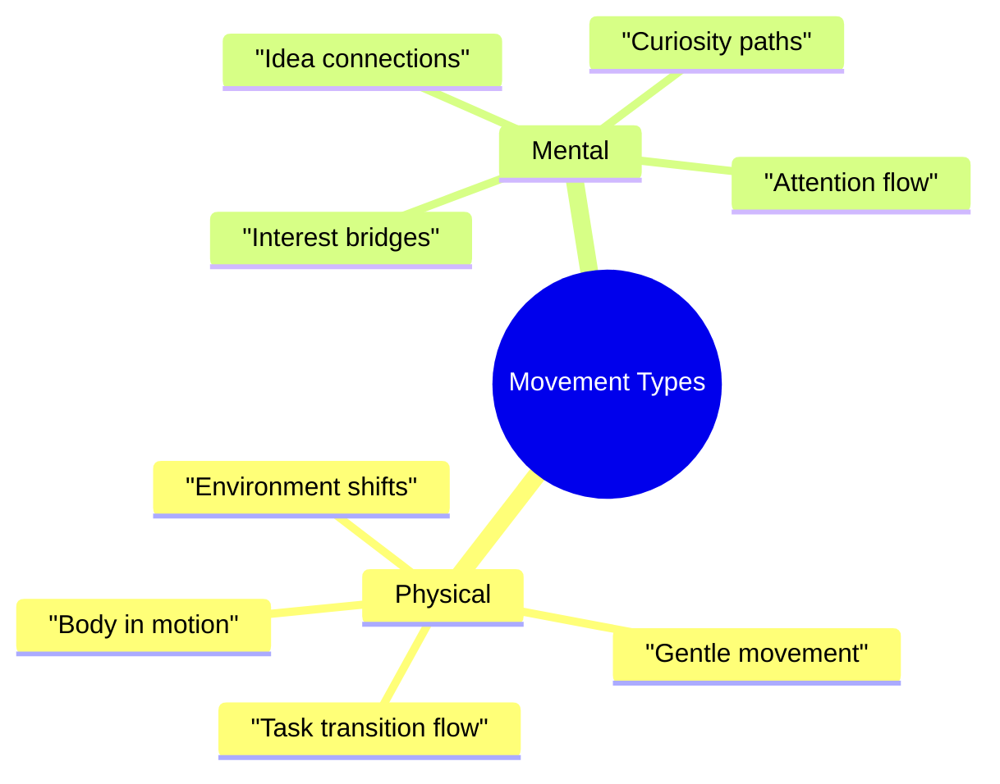

# Task Momentum: Using Movement to Overcome Inertia 🔄

> [!tip] Quick Start Guide
> When you're struggling to start or transition between tasks:
> 1. Don't force a full stop - stay in motion from your current activity, even if it's just fidgeting
> 2. Look around your current space - what's one tiny thing you could start moving toward your next task?
> 3. Give yourself permission to overlap - you don't have to finish one thing completely before letting the next one begin
> 4. Set a timer for 5 minutes of transition time - this is your bridge, not your destination
> 5. Let movement be your guide - physical motion often leads to mental motion

Have you ever noticed how much easier it is to keep going once you're already in motion? Think about it - when you're in the middle of cleaning one space, starting on the next area feels natural. But if you sit down between spaces, starting again feels like moving a mountain. This isn't just your imagination - it's a fundamental principle we can actually use to our advantage.

## Understanding Momentum in Our Brains

Task momentum isn't just about productivity - it's about working with our brain's natural tendencies instead of fighting against them. When we're in motion, our brains are already engaging executive function, managing attention, and processing dopamine. Each time we come to a complete stop, we have to rebuild all of these systems from scratch.

Think of it like a car with a finicky starter motor. Once the engine is running, you can drive all day. But each time you turn it off completely, you risk struggling to get it started again. Sometimes it's better to keep the engine idling than to risk a complete shutdown.

## The Rolling Start: Maintaining Movement

Imagine a relay race - runners don't start from a standstill. They build their momentum while their teammate is still running, creating a smooth handoff of motion and energy. We can use this same principle with tasks, starting to roll into our next activity while still engaged with the current one.

### Why This Works

When you're already in motion, several powerful forces are working in your favor:
- Your executive function systems are warmed up and running
- Dopamine is actively flowing from your current task engagement
- Your brain is in "doing" mode rather than "deciding" mode
- Physical movement is supporting mental movement

Most importantly, you're bypassing the hardest part of task initiation - the cold start. Instead of trying to generate momentum from nothing, you're redirecting existing momentum into a new channel.

### Making It Work in Real Life

Let's say you're wrapping up an email. Instead of focusing on "finishing" the email completely, start thinking about your next task while you're still typing. Maybe you need to review some documents next. While you're doing your final email proofread, use your free hand to start pulling those documents closer to you. As you hit send, you're already reaching for the first document.

The key is to stop thinking about tasks as completely separate entities that need hard starts and stops. Instead, look for ways to let them flow into each other. Your brain doesn't shut off between tasks - why should your movement?

## The Slingshot: Using Resistance as Fuel

We often think of procrastination as the enemy of productivity. But what if we could use that avoidance energy as a tool instead of treating it as a barrier? The Slingshot Method does exactly that - it harnesses the energy of procrastination and redirects it productively.

### Understanding the Mechanics

Think about how a slingshot works - you pull back to build potential energy, then release that energy to propel something forward. Our tendency to avoid certain tasks creates a similar kind of potential energy. Instead of fighting that pull-back, we can use it to:
- Build up resources and preparation
- Create pressure that drives action
- Generate momentum through related activities

The key insight is that procrastination isn't just avoidance - it's stored energy looking for a direction.

### Putting It Into Practice

Let's say you're avoiding writing a report. Instead of getting stuck in guilt, consciously choose to procrastinate productively:
1. Acknowledge your avoidance openly: "I notice I'm not ready to write this report yet."
2. Look for related tasks that feel more approachable:
   - Organizing your reference materials
   - Setting up your document template
   - Creating a rough outline
   - Gathering example reports for inspiration

As you complete these prep tasks, you're building potential energy. When the pressure peaks (usually near deadline), you'll have everything staged for release into focused action.

## Creating Your Momentum Support System

### Environmental Staging
Your space can either support or hinder momentum. Create zones that flow into each other naturally:
- Position related activities physically near each other
- Keep transition tools easily accessible
- Maintain clear paths for physical movement
- Design visual cues that guide next actions

### Movement Tools
Having the right supports ready can make maintaining momentum much easier:
- Visual timers to track transition periods
- Fidget tools for physical movement
- Body doubling options (in person or virtual)
- Task staging areas for smooth handoffs

### Emergency Momentum Protocols

> [!warning] When Movement Breaks Down
> If you find yourself coming to a complete stop:
> 1. Stay exactly where you are - resist the urge to retreat
> 2. Notice your current state without judgment
> 3. Find the smallest possible movement you could make
> 4. Use body-doubling if available
> 5. Start with a micro-task to rebuild momentum
> 
> Remember: You don't have to generate high energy, you just need to maintain gentle movement.

## Learning Your Momentum Patterns

Start paying attention to when momentum flows naturally and when it tends to break down:

### Track Success Patterns
- Which tasks chain together easily for you?
- What times of day do transitions flow better?
- Which environmental factors support movement?
- What types of momentum are easiest to maintain?

### Notice Common Pitfalls
- Over-preparation creating resistance
- Task overwhelm breaking flow
- Lost transitions between activities
- Environmental barriers to movement

## Connecting with Other Systems
- [[Energy States]] - Match momentum strategies to current capacity
- [[Environment Anchors]] - Create spaces that support flow
- [[Pattern Recognition]] - Learn your natural momentum rhythms
- [[Support Network]] - Build momentum-maintaining relationships

Remember: The goal isn't constant high-energy motion. It's about maintaining gentle forward movement, understanding your rhythms, and working with your brain's natural tendencies rather than against them.
## Related
[[Task Management Systems]] | [[Energy States]] | [[Pattern Recognition]]
