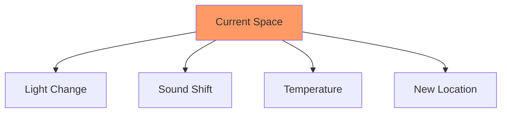
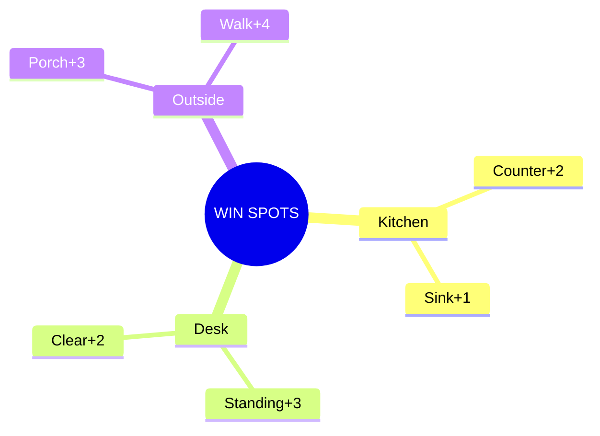
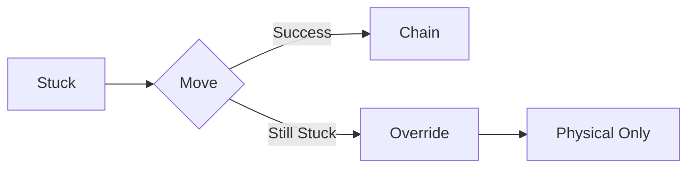

# 🔥 Catch Spark Protocol

## State Check
```dataview
TABLE WITHOUT ID
  energy_level as "Energy",
  environment_score as "Environment",
  last_win as "Last Win"
FROM "states"
WHERE file.name = "current_state"
```

## Instant Actions
1. PHYSICAL MOVE
   - Stand → Different (+2)
   - Water path (+1)
   - Item relocate (+1)
   - Surface clear (+2)

2. ENVIRONMENT HACK


3. TASK SCOPE
   - Visible only
   - One surface
   - 2min max
   - Current tools

## Win Tracking
```dataview
LIST points
FROM "momentum/quick_wins"
WHERE date = date(today)
LIMIT 5
```

## Power Locations


## Chain Stats
- Current Streak: `= this.streak`
- Power Location: `= this.location`
- Last Pattern: `= this.pattern`

## Emergency Override
