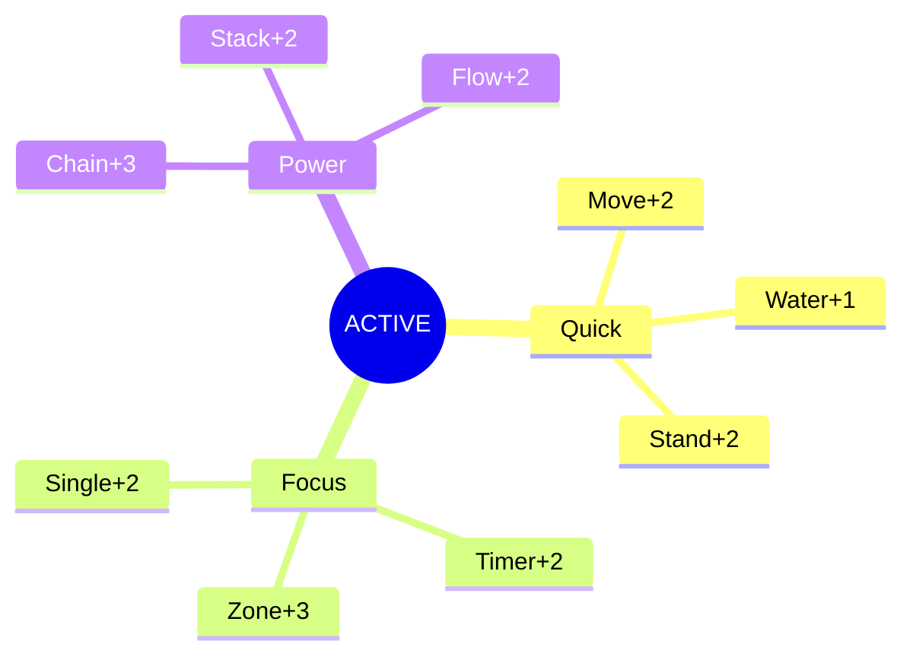
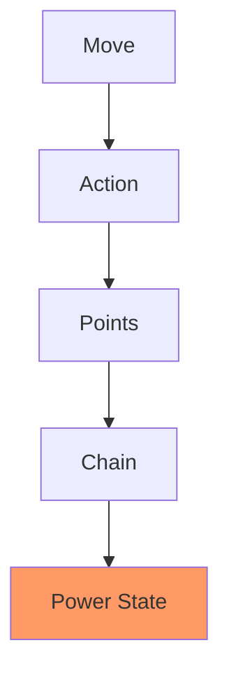
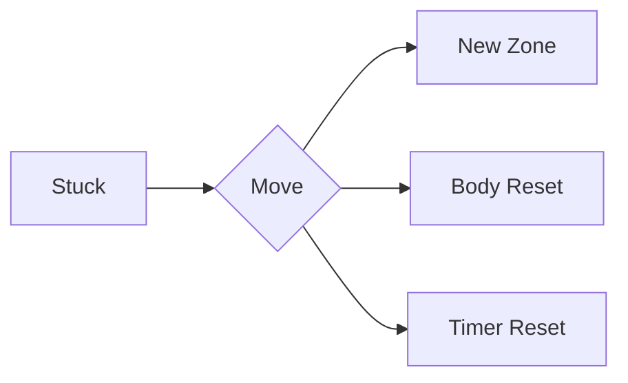

# ⚡ Emergency Momentum Protocol

## State Monitor
```dataview
TABLE WITHOUT ID
  state as "State",
  energy as "Energy",
  momentum_streak as "Streak",
  current_points as "Points"
FROM "states/current"
```

## Active Buffs


## PROTOCOL ACTIVATE
1. MOVE → ACTION
   - Physical shift required
   - Use visible triggers
   - [[Catch Spark|Spark Protocol]]

2. SET BOUNDS
   - ![[Timer Widget]]
   - One clear target
   - Current location
   - Available tools

## Point Stream
```dataview
LIST
FROM "momentum/points"
WHERE date = date(today)
SORT time DESC
LIMIT 3
```

## Chain Effects


## Quick Stats
- Chain Level: `= this.chain_level`
- Power Zone: `= this.location`
- Flow State: `= this.flow_time`
- Next Target: `= this.next_win`

## Emergency Reset
