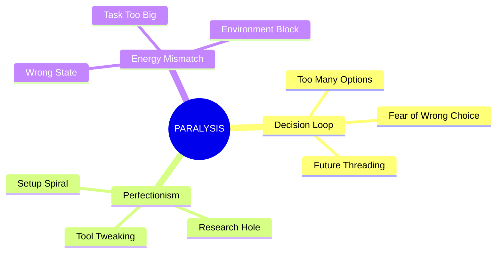
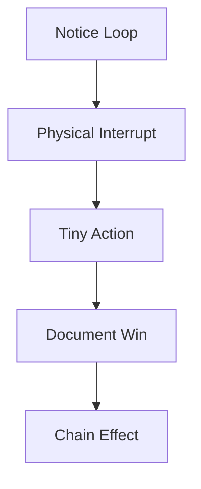

# Task Paralysis Protocol

## Quick Check
```dataview
TABLE WITHOUT ID
  state as "Current State",
  paralysis_type as "Type",
  last_override as "Last Override"
FROM "states"
WHERE contains(file.name, "paralysis")
```

## Recognition Patterns


## Emergency Override System
1. PHYSICAL FIRST
   - Stand up
   - Change rooms
   - Move anything
   - [[Emergency Momentum|Catch Spark]]

2. SCOPE KILL
   - 2-minute version
   - Visible only
   - Single surface
   - One tool only

3. CHOICE DESTROY
   - First visible item
   - Current location
   - Existing tools
   - No research

## Pattern Breaking


## Quick Wins Database
```dataview
LIST
FROM "momentum/wins"
WHERE contains(file.tags, "paralysis-breaker")
SORT date desc
LIMIT 5
```

## State Tracking
- Current Loop Type: `= this.loop_type`
- Override Used: `= this.override`
- Success Pattern: `= this.pattern`
- Chain Trigger: `= this.trigger`

Remember: Motion > Direction