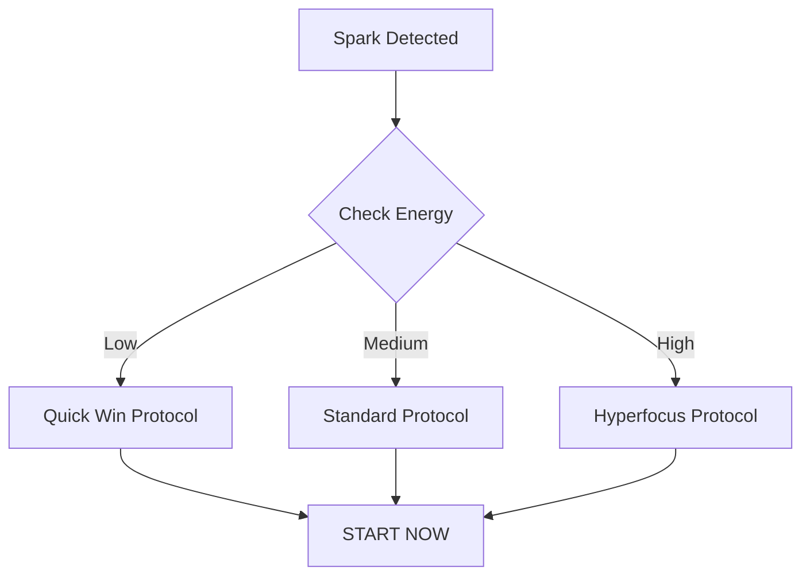

# Emergency Task Start Protocol

## Quick Access Protocol


## Instant Start Commands
### 🧟‍♂️ Low Energy Mode
1. Pick ONE thing from Quick Wins list
2. Set timer for 5 minutes
3. Move one object related to task
4. START - no more prep

### ⚡ Medium Energy Mode
1. Check Task Menu for current energy
2. Set timer for 10 minutes
3. Announce task out loud
4. START - resist urge to plan more

### 🚀 High Energy Mode
1. Quick capture other ideas
2. Set timer for 25 minutes
3. Clear immediate space only
4. START - save optimization for later

## Emergency Overrides
### When Frozen
1. Say "I'll just look at it"
2. Touch one task-related item
3. Set timer for 2 minutes
4. Allow yourself to stop after timer

### When Overwhelmed
1. Pick smallest visible task
2. Use [[Constraint Box Method]] method
3. Set physical timer (not phone)
4. Promise yourself a break after

### When Distracted
1. Write down distraction for later
2. Set timer for current interest
3. Use current focus, even if not priority
4. Link to planned task if possible

## Task Exit Strategy
### Clean Exit
1. Note next obvious step
2. Stage one tool for restart
3. Set physical reminder
4. Quick capture remaining thoughts

### Emergency Exit
1. Take photo of current state
2. Voice note next step
3. Leave one visual cue
4. Accept current progress

## Integration Points
- Links to [[Energy States]]
- Uses [[Quick Wins List]]
- Supports [[Task Management Systems]]
- Feeds into [[Pattern Recognition]]

## System Maintenance
### Daily
- Update Quick Wins list
- Reset emergency tools
- Review exit notes

### Weekly
- Review success patterns
- Adjust timer settings
- Update task menus

## Related Tools
- Visual timers
- Physical reminders
- Voice recorder
- Camera for state capture
- Fidget tools
- Success trackers

## Success Tracking
### Log Template
```markdown
Date: 
Initial State: [Frozen/Overwhelmed/Distracted]
Protocol Used:
What Worked:
What Didn't:
Next Time:
```

### Pattern Notes
- Track time of day
- Note energy level
- Record environment
- List helpful tools
- Document blockers

## Common Pitfalls
1. Over-preparation
   - Solution: Set prep timer
   - Backup: Use constraint box

2. Scope Creep
   - Solution: Write ideas for later
   - Backup: Timer boundary

3. Perfect Moment Waiting
   - Solution: "Now is better than perfect"
   - Backup: Emergency override

## Emergency Contacts
- Body double options
- Accountability partners
- Support resources
- Crisis helpers

## Related
[[Energy States]] | [[Quick Wins List]] | [[Task Management Systems]]
