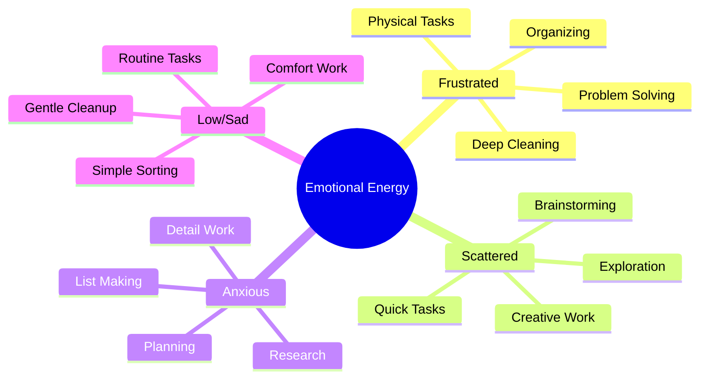

# The Emotion-Task Bridge 🌈

> [!tip] Quick Start
> 1. Notice your current emotional state
> 2. Check the matching task category below
> 3. Pick one small task from that list
> 4. Gather any needed support tools
> 5. Set a timer and begin

Sometimes our strongest emotions can feel like barriers to getting things done. But what if we could transform these intense feelings into fuel for action? The Emotion-Task Bridge helps us match our emotional state to tasks that actually work with that energy, not against it.

## Energy States at a Glance 



## Task Categories in Detail

> [!multi-column]
>
>> ### 🔥 Frustrated Energy
>> **Perfect for:**
>> - Deep cleaning
>> - Reorganizing spaces
>> - Physical exercise
>> - Tackling obstacles
>> 
>> **Support needed:**
>> - Physical space to move
>> - Clear end point
>> - Safety boundaries
>> - Recovery plan
>
>> ### ⚡ Scattered Energy
>> **Perfect for:**
>> - Creative projects
>> - Quick task batches
>> - Idea generation
>> - Exploring options
>>
>> **Support needed:**
>> - Capture tools
>> - Timer boundaries
>> - Task list ready
>> - Grounding object
>
>> ### 🌀 Anxious Energy
>> **Perfect for:**
>> - Detailed research
>> - System creation
>> - List making
>> - Future planning
>>
>> **Support needed:**
>> - Quiet space
>> - Comfort items
>> - Time limits
>> - Body doubling
>
>> ### 🌧️ Low/Sad Energy
>> **Perfect for:**
>> - Routine tasks
>> - Gentle sorting
>> - Comfort work
>> - Simple review
>>
>> **Support needed:**
>> - Cozy environment
>> - Minimal pressure
>> - Easy wins ready
>> - Support person

## Making It Work 🛠️

### Daily Practice
1. Regular energy check-ins
2. Task list reviewing
3. Environment setup
4. Support tool prep

### Task Bank Template
```markdown
Task Name:
Energy State Match:
Time Needed:
Tools Required:
Support Needed:
Completion Signals:
```

> [!warning] Remember
> This isn't about forcing productivity - it's about having options for channeling energy when you're ready to act.

## Related Notes
- [[Energy States]]
- [[Task Management Systems]]
- [[Pattern Recognition]]
- [[Support Network]]
