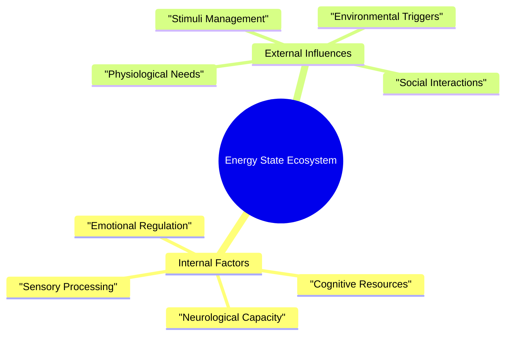

# 🔋 Energy States: Understanding Your Brain's Power Management System

> [!tip] Compassionate Navigation
> Your energy is not a moral failing or a measure of your worth. It's a complex, dynamic system that deserves understanding, not judgment.

## The Energy Landscape: Beyond Simple Productivity

Imagine your brain as a sophisticated power grid, constantly negotiating resources, managing inputs, and adapting to changing conditions. Traditional productivity models treat energy like a light switch - on or off. But your brain is more like a intricate ecosystem, with multiple interconnected systems constantly shifting and responding.



## Navigating the Three Primary Energy States

### 🧟‍♂️ Zombie Mode: Survival and Gentle Restoration

**What It Feels Like:**
The world is muffled. Your body feels like it's wearing a lead suit. Thoughts move through molasses, and the simplest decisions feel like solving complex mathematical equations. This isn't laziness - this is your brain's deep conservation mode.

**Neurological Landscape:**
- Minimal cognitive resources available
- Heightened sensory sensitivity
- Decision-making circuits are running on emergency power
- Emotional regulation requires maximum effort

**Survival Strategies:**
1. **Radical Acceptance**
   - Acknowledge your current state without self-judgment
   - Your brain is doing its best to protect and preserve you

2. **Micro-Momentum Builders**
   - Quick Wins List becomes your lifeline
   - Focus on routine, automatic tasks
   - Physical movement in tiny, manageable doses
   - Prioritize sensory comfort and basic needs

**Support Ecosystem:**
- Visual task reminders
- External body doubling
- Sensory regulation tools
- Comfort-focused environment

### ⚡ Spark Mode: Potential in Motion

**What It Feels Like:**
A flickering candle of energy. Mental clarity comes in waves - sometimes bright, sometimes dim. You can see the possibility of action, but sustaining it feels challenging.

**Neurological Landscape:**
- Intermittent cognitive resources
- Fluctuating attention capabilities
- Basic decision-making possible
- Energy management becomes crucial

**Navigation Strategies:**
1. **Momentum Architecture**
   - Task Menus tailored to current capacity
   - Short-duration focused sprints
   - Flexible task switching
   - Build energy through careful, intentional movement

2. **Transition Support**
   - Use tools that capture fleeting thoughts
   - Create gentle bridges between tasks
   - Recognize and celebrate small wins

**Support Ecosystem:**
- Timing and transition tools
- Movement-based focus aids
- Quick capture technologies
- Flexible environment setup

### 🚀 Hyperfocus Mode: Full System Activation

**What It Feels Like:**
Your brain is a high-performance engine. Mental clarity is crisp, physical energy is available, and the world falls away except for your current focus.

**Neurological Landscape:**
- High cognitive processing capacity
- Strong task initiation
- Enhanced pattern recognition
- Elevated sensory tolerance

**Optimization Strategies:**
1. **Focused Intensity Management**
   - Leverage complex task opportunities
   - Engage in creative and deep work
   - Connect multiple related projects
   - Implement strategic breaks

2. **Resource Allocation**
   - Proactive environment control
   - Sustenance and hydration planning
   - Time and focus tracking

**Support Ecosystem:**
- Sophisticated time management tools
- Break and reset protocols
- Nutrition and hydration support
- Dynamic environment adjustment

## State Transition Dynamics

### Down-Shift Triggers
- Physiological needs (hunger, fatigue)
- Environmental changes
- Social interaction intensity
- Task complexity
- Medication cycles
- Circadian rhythms

### Up-Shift Catalysts
- Physical movement
- Novelty and interest
- Social energizing interactions
- Momentum from small successes
- Inspirational input
- Environmental stimulation

## Comprehensive State Tracking

### Daily Energy Mapping

```markdown
## Morning Check-in
Time: 
Physical Energy [1-5]: 
Mental Clarity [1-5]: 
Environmental Support [1-5]:
Initial State Classification:

## Mid-day Recalibration
Time: 
Energy Transitions:
Trigger Observations:
Current State:

## Evening Reflection
Time: 
Energy Arc:
Key Patterns:
Next Day Preparation:
```

### State Calculator

Physical Energy [1-5]: 
Mental Clarity [1-5]:
Environmental Support [1-5]:
Medication Impact [1-5]:
Time of Day Factor [1-5]:

**Total Score Interpretation:**
- 5-10: Zombie Mode - Gentle Restoration
- 11-18: Spark Mode - Potential Activation
- 19-25: Hyperfocus Ready - Full Engagement

## Core Insight

Your energy is not a linear resource to be depleted or maximized. It's a living, breathing ecosystem that requires observation, respect, and adaptive support.

## Related Support Systems
- [[Task Management Systems]]
- [[Crisis Management]]
- [[Emergency Task Start Protocol]]
- [[Emotional Regulation]]

Would you like to:
1. Assess your current energy state?
2. Explore state transition strategies?
3. Develop personalized support tools?
4. Rest and recalibrate?
## Related
[[Emergency Task Start Protocol]] | [[Pattern Recognition]] | [[Task Management Systems]]
