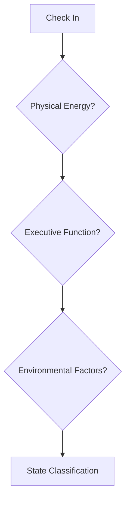

# Current Energy State

## Quick State Assessment


## Energy States Defined

### 🧟‍♂️ Zombie Mode
#### Indicators
- Body feels heavy
- Thoughts are foggy
- Task initiation very difficult
- Sensory sensitivity high
- Decision-making impaired

#### Best Actions
- Use [[Quick Wins List]]
- Physical movement tasks
- Routine/automatic tasks
- Low decision tasks
- Comfort zone work

#### Support Needed
- Visual reminders
- External body doubling
- Physical timers
- Sensory regulation tools

### ⚡ Spark Mode
#### Indicators
- Mental clarity comes and goes
- Energy fluctuates
- Can initiate but may not sustain
- Normal sensory threshold
- Basic decisions possible

#### Best Actions
- Use [[Task Menus]]
- Mixed difficulty tasks
- Short duration sprints
- Flexible switching
- Building momentum

#### Support Needed
- Task timing tools
- Transition supports
- Quick capture tools
- Movement options

### 🚀 Hyperfocus Ready
#### Indicators
- Mental clarity high
- Physical energy available
- Strong task initiation
- Higher sensory tolerance
- Decision-making strong

#### Best Actions
- Use [[Active Projects]]
- Complex tasks
- Creative work
- Deep focus work
- Multiple connected tasks

#### Support Needed
- Time tracking
- Break reminders
- Sustenance nearby
- Environment control

## State Tracking

### Daily Log Template
```markdown
## Morning Check-in
Time: 
Physical State: [1-5]
Mental State: [1-5]
Environmental Factors:
Current Classification:

## Mid-day Check-in
Time:
State Changes:
Triggers Noted:
Current Classification:

## Evening Check-in
Time:
Energy Progression:
Notable Patterns:
Next Day Prep:
```

### State Transition Triggers
#### Down-Shifts
- Hunger/Thirst
- Temperature changes
- Social interaction level
- Task complexity
- Time of day
- Medication timing

#### Up-Shifts
- Movement/Exercise
- Interest spark
- Social energizing
- Success momentum
- Novel input
- Environmental change

## Environmental Factors
### Supportive Elements
- Lighting levels
- Sound management
- Temperature control
- Air quality
- Physical comfort
- Movement space

### Detractors
- Noise disruption
- Visual clutter
- Temperature extremes
- Physical discomfort
- Social pressure
- Time pressure

## Integration Tools
### State Calculator
```markdown
Physical Energy [1-5]: 
Mental Clarity [1-5]:
Environmental Support [1-5]:
Medication Status [Y/N]:
Time of Day Factor [1-5]:

Total Score: /25
- 5-10: Zombie Mode
- 11-18: Spark Mode
- 19-25: Hyperfocus Ready
```

### Quick Reference Cards
#### Zombie Mode Card
- Go-to tasks
- Support tools
- Safe spaces
- Recovery methods

#### Spark Mode Card
- Momentum builders
- Transition tools
- Focus maintainers
- Energy preservers

#### Hyperfocus Card
- Optimization tools
- Support needs
- Break reminders
- Exit strategies

## Related
[[Emergency Task Start Protocol]] | [[Pattern Recognition]] | [[Task Management Systems]]
