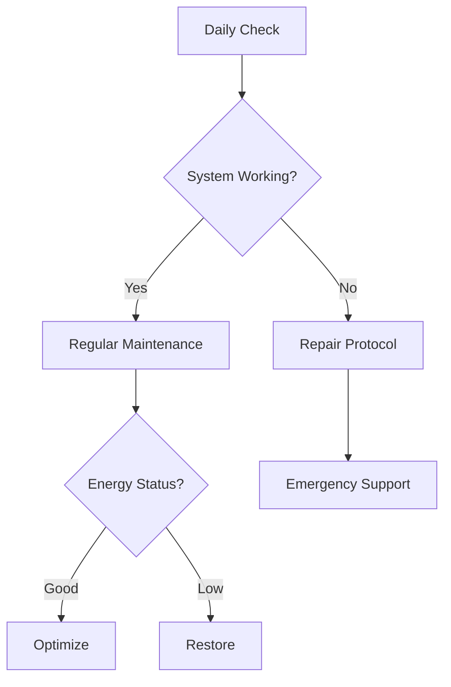

# Maintenance Master System

## Quick Status Check


## System Maintenance

### Daily System Hygiene
#### Morning Reset
- [ ] Check [[Current Energy State]]
- [ ] Refresh [[Quick Wins List]]
- [ ] Update [[Task Menus]]
- [ ] Stage critical tools
- [ ] Clear capture points

#### Evening Cleanup
- [ ] Process quick capture notes
- [ ] Update task statuses
- [ ] Stage tomorrow's tools
- [ ] Clear work surfaces
- [ ] Reset support systems

### Weekly System Care
```markdown
## Sunday System Review
1. Archive completed items
2. Refresh task menus
3. Clean capture tools
4. Update tracking systems
5. Prepare weekly templates
```

### Monthly System Audit
```markdown
## System Health Check
- Working Components:
- Failing Components:
- Need Maintenance:
- Need Replacement:
- New Systems to Try:
```

## Personal Maintenance

### Energy Management
#### Recharge Protocols
1. Quick Recharge (10 min)
   - Sensory break
   - Physical movement
   - Hydration check
   - Deep breathing
   - Stim time

2. Medium Reset (30 min)
   - Nature exposure
   - Creative expression
   - Social recharge
   - Physical exercise
   - Special interest time

3. Full Restore (2+ hours)
   - Deep rest
   - Extended special interest
   - Social battery recharge
   - Sensory regulation
   - System reset

### Emotional Maintenance

#### Daily Check-in Template
```markdown
## Emotional Weather Report
Current State: [💫/🌤️/⛈️]
Energy Level: [1-5]
Sensory Load: [1-5]
Masking Level: [1-5]
Support Needed: [Type]
```

#### Burnout Prevention
1. Early Warning Signs
   - Task avoidance increase
   - System resistance
   - Sensory sensitivity spike
   - Increased masking fatigue
   - Executive function decline

2. Intervention Protocols
   - Immediate load reduction
   - Support system activation
   - Environment optimization
   - Routine simplification
   - Recovery mode activation

3. Recovery Practices
   - Minimal viable routine
   - Sensory sanctuary time
   - Special interest immersion
   - Social pressure reduction
   - System pressure release

## Emergency Maintenance

### System Recovery
#### When Systems Fail
1. Acknowledge without shame
2. Activate backup protocol
3. Reduce to core functions
4. Rebuild gradually
5. Document lessons

#### Quick Repair Kit
- Minimal task list
- Emergency contacts
- Comfort tools
- Reset protocols
- Recovery checklist

### Personal Recovery
#### Overwhelm Protocol
1. Stop current tasks
2. Activate sensory kit
3. Use comfort script
4. Contact support person
5. Begin recovery sequence

#### Reset Toolkit
- Sensory regulation tools
- Comfort objects
- Stim toys
- Pressure items
- Safe space access

## Integration & Tracking

### Maintenance Log
```markdown
## Daily Maintenance Log
Date:
Systems Checked:
Energy Management:
Emotional Status:
Interventions Used:
Next Steps:
```

### Pattern Recognition
Track:
- System failure patterns
- Energy depletion cycles
- Recovery effectiveness
- Support tool usage
- Environmental factors

## Prevention Strategies

### System Longevity
1. Regular reviews
2. Gradual updates
3. Backup methods
4. Simplification cycles
5. Flexibility allowance

### Personal Sustainability
1. Energy budgeting
2. Masking management
3. Boundary maintenance
4. Support network care
5. Recovery scheduling

## Related
[[Pattern Recognition]] | [[Energy Management]] | [[Crisis Management]]
```

Would you like me to:
1. Create more detailed protocols for specific maintenance scenarios?
2. Develop emergency maintenance cards?
3. Add more burnout prevention strategies?
4. Create integration guides with other systems?

The maintenance system is designed to be both proactive and reactive, helping prevent burnout while providing clear recovery protocols when needed. It's particularly focused on sustainability and preventing the common ADHD/autism cycle of system abandonment and burnout.