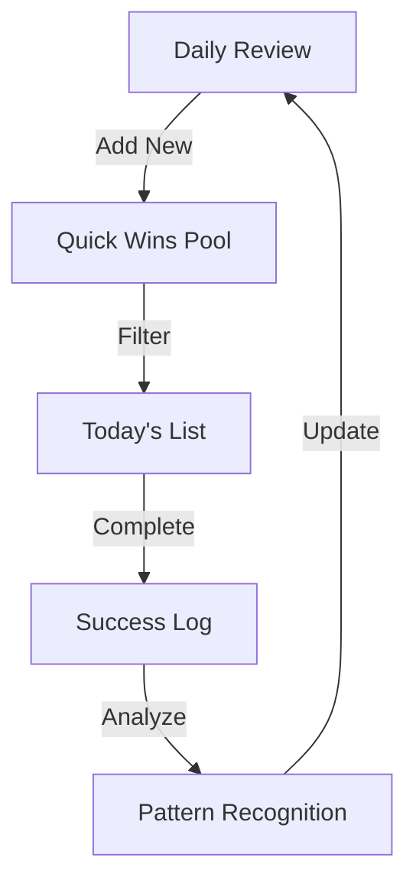

# Quick Wins List

## Purpose
Fast-access list of low-barrier tasks that build momentum and provide quick dopamine hits.

## Core Principles
1. Must take <10 minutes
2. Require minimal decision-making
3. Have clear completion state
4. Provide visible results
5. Need minimal setup

## Task Categories

### 🧹 Physical Quick Wins
- Clear one surface
- Sort one drawer
- File loose papers
- Wipe down mirrors
- Empty one trash bin
- Collect dirty cups
- Make bed corners
- Change hand towels

### 💻 Digital Quick Wins
- Clear phone notifications
- Delete 10 emails
- Update one password
- Empty downloads folder
- Clear browser tabs
- Back up one file
- Update one profile
- Sort 5 photos

### ✅ Work Quick Wins
- Send "done" update
- Schedule one meeting
- File expense receipt
- Update task status
- Send thank you note
- Clear notifications
- Label one folder
- Archive completed items

### 🎯 Progress Quick Wins
- Check off done items
- Update progress bar
- Move task to "done"
- Log daily metrics
- Update time log
- Record one win
- Check calendar
- Set one reminder

## Implementation

### List Maintenance


### Selection Rules
1. Maximum 5 visible at once
2. Must match current energy
3. Rotate daily to prevent staleness
4. Include one from each category
5. Must be completable with available tools

## Usage Guidelines

### When to Use
- Starting your day
- Breaking task paralysis
- Between bigger tasks
- During energy dips
- After interruptions
- Building momentum
- Clearing brain fog
- Avoiding bigger tasks

### Success Tips
1. Don't batch quick wins
2. Complete one fully
3. Celebrate immediately
4. Note energy impact
5. Keep tools handy

## Integration

### Task Template
```markdown
Quick Win: [Task Name]
Category: [Physical/Digital/Work/Progress]
Time Estimate: [1-10 minutes]
Tools Needed:
Completion Marker:
Energy Level Required: [🧟‍♂️⚡🚀]
```

### Success Log
```markdown
Date:
Task:
Time Taken:
Energy Before:
Energy After:
Notes:
```

## Related
[[Emergency Task Start Protocol]] | [[Energy States]] | [[Task Menus]]
