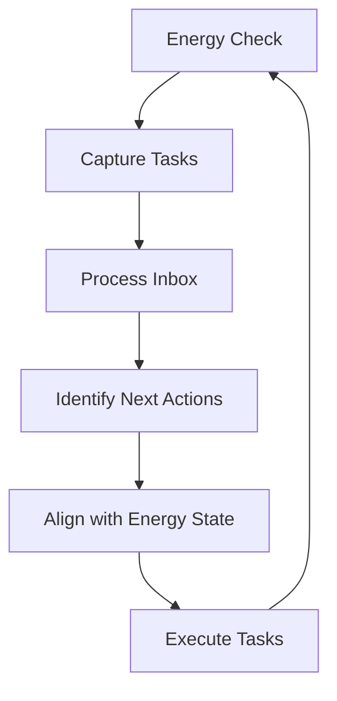

# GTD Integration

## Overview
- Brief explanation of GTD
- How GTD reinforces our Executive Function Support System

## Key GTD Principles in Our System
1. Capture
2. Clarify
3. Organize
4. Reflect
5. Engage

## GTD-Enhanced Daily Workflow

## GTD and Energy Management
- Using GTD contexts in different energy states
- Adapting GTD practices for low-energy days

## GTD-Inspired Maintenance
- Daily review process
- Weekly review checklist
- Monthly system audit

## GTD Tools in Our System
- Inbox setup
- Project list management
- Next Actions list
- Waiting For tracking

## Measuring GTD Effectiveness
- Key metrics to track
- How to adjust the system based on results
