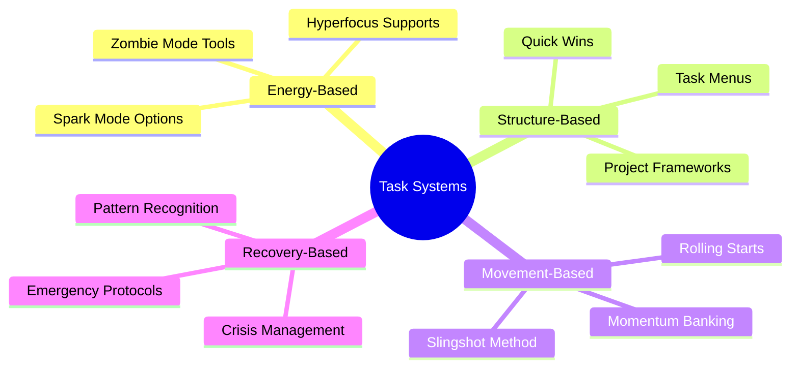
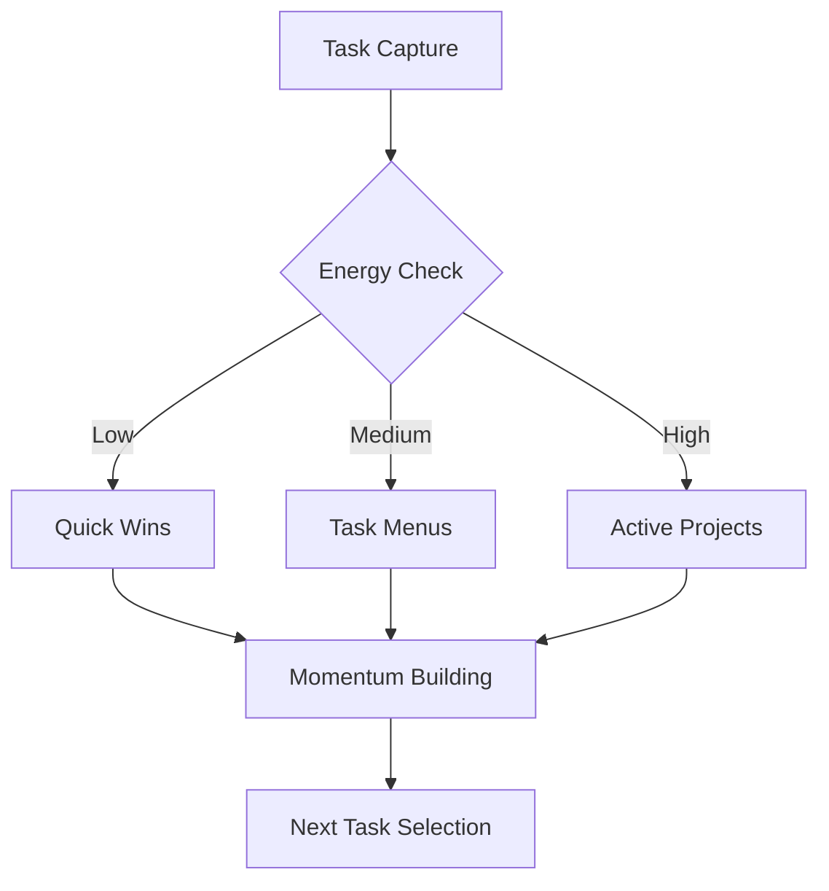
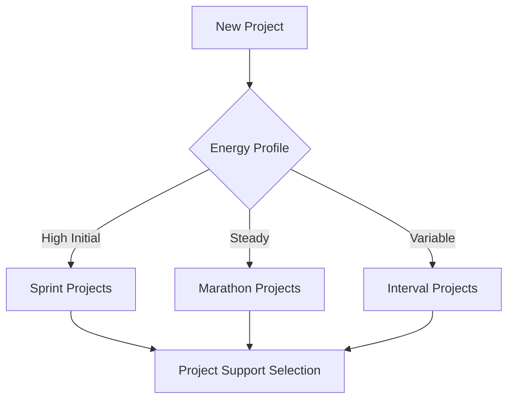
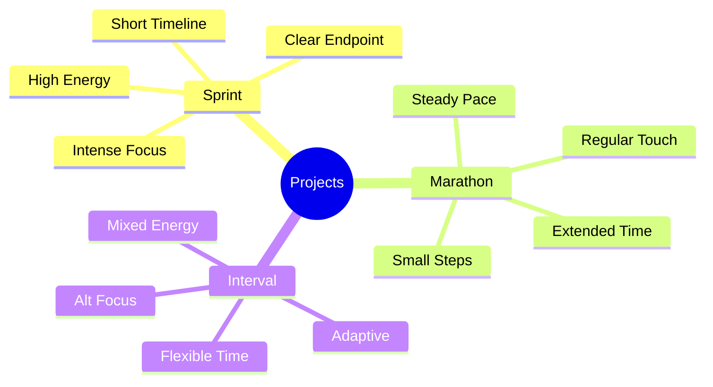
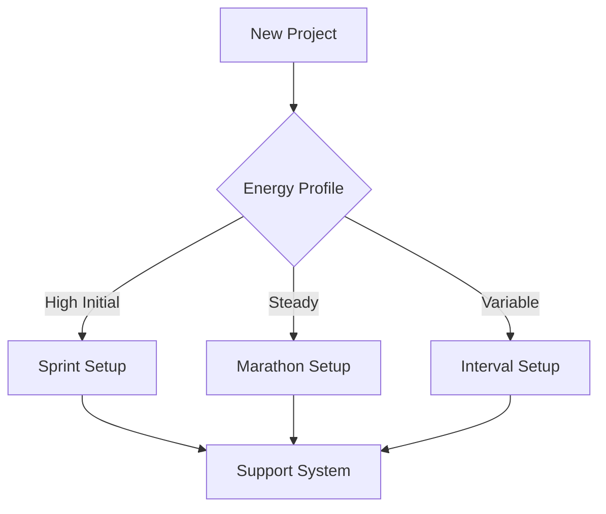
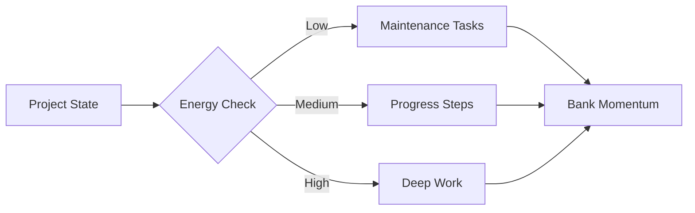

# Optimizing Executive Function for Neurodivergence

Created: 2024-11-24 00:44:04 UTC
Updated: 2024-11-24 01:03:33 UTC
UUID: b0a44e87-5265-4d40-ae3e-832ded83a683
Account: 912bd4f0-edc2-4966-a180-6d01c38e12d1

---

**Human** - 2024-11-24 00:44:15 UTC

i think you now have a pretty full understanding of what i have going on in my ND Second Brain of sorts

---

**Assistant** - 2024-11-24 00:44:15 UTC

 After reviewing your comprehensive system, I notice some interesting patterns and opportunities. Let me suggest some additional frameworks that could complement your existing setup while specifically targeting executive dysfunction and task avoidance from a neurodivergent perspective.

1. The "Productive Procrastination Pipeline"
- Instead of fighting task avoidance, strategically channel it
- Create a hierarchy of tasks where procrastinating on one task means completing another
- Example: Avoiding big report → organize desk → sort emails → eventually circle back to report with a cleaner environment and some momentum

2. The "Energy Arbitrage" Method
- Based on your excellent energy states tracking
- Identify tasks that generate versus consume executive function
- Strategically place "energy generating" tasks (often special interest related) before difficult executive function tasks
- Create an "energy profit" by timing transitions carefully

3. The "Sensory Reset Button"
- A personalized sequence of sensory inputs that can help reset executive function
- Like rebooting a computer when it's frozen
- Example sequence:
  * 30 seconds of intense physical movement 
  * Specific sound/music transition
  * Temperature change (cold water on hands)
  * Strong taste (mint/sour candy)
  * Deep pressure input

4. "Task Momentum Banking"
- Similar to spoon theory but focused on momentum rather than energy
- When in a productive state, "bank" partially completed tasks
- Leave tasks deliberately unfinished at their most interesting point
- Creates natural entry points when executive function is lower

Would you like me to elaborate on any of these approaches? I notice they could integrate well with your existing constraint box and emergency protocols while adding some new dimensions to your system.

I'm particularly interested in how you're currently handling task transitions - that's often where a lot of executive function gets depleted for neurodivergent individuals. Would you like to explore some additional strategies around that specific challenge?

---

**Human** - 2024-11-24 00:45:28 UTC

I like it. I would love to hear more about some of your ideas as we also fill in existing gaps in my framework (lots of missing pages / hanging links still)

---

**Assistant** - 2024-11-24 00:45:28 UTC

 Looking at your system and the gaps, let's explore some targeted approaches. I notice several empty areas where we could develop frameworks that specifically address executive dysfunction "stuck points."

Let's start with elaborating the "Task Momentum Banking" concept since it connects well with your existing Energy States and Emergency Task Start Protocol. This could help fill out some of your empty notes while adding new dimensions.


<antArtifact identifier="momentum-banking" type="text/markdown" title="Task Momentum Banking Framework">
# 🏦 Task Momentum Banking

## Core Concept
Task Momentum Banking treats executive function momentum as a resource that can be strategically saved and spent, similar to how a bank manages deposits and withdrawals.

## Key Principles
1. **Momentum Conservation**
   - Leave tasks at "high interest points"
   - Create clear re-entry points
   - Preserve context for future self

2. **Strategic Incompletion**
   - Deliberately stop at 80%
   - Leave obvious next steps
   - Document current thinking

3. **Context Preservation**
   - Physical state capture
   - Mental state notes
   - Environment documentation

## Implementation

### Momentum Deposits
#### High-Energy States
- Complete 80% of task
- Document clear next steps
- Stage tools for continuation
- Create visual progress markers
- Leave breadcrumbs for future self

#### Task Staging
- Pre-decision making
- Tool arrangement
- Environment setup
- Entry point creation
- Success criteria definition

### Momentum Withdrawals
#### Low-Energy States
- Use preserved context
- Follow previous breadcrumbs
- Leverage staged tools
- Build on existing progress
- Complete final 20%

#### Emergency Access
- Quick-start points
- Pre-made decisions
- Ready-to-use setups
- Clear success metrics
- Minimal friction paths

## Integration Tools

### Momentum Ledger
```markdown
## Task Entry
Task Name:
Current Progress: [%]
Next Action:
Tools Staged:
Environment Notes:
Mental State:
Reentry Cues:
```

### Context Preservation Methods
1. **Physical Anchors**
   - Staged tools
   - Visual markers
   - Environment setup
   - Location cues
   
2. **Mental Breadcrumbs**
   - Voice notes
   - Quick captures
   - Progress photos
   - State documentation

3. **Transition Bridges**
   - Link to next task
   - Energy preservation
   - Context maintenance
   - Momentum transfer

## Emergency Protocols

### When Momentum Crashes
1. Check momentum ledger
2. Review staged tasks
3. Access quick-start points
4. Use preserved context
5. Build from preserved state

### Momentum Recovery
1. Acknowledge crash without shame
2. Review available deposits
3. Choose appropriate withdrawal
4. Use preserved context
5. Build new momentum

## Maintenance Systems

### Daily Banking
- Morning momentum audit
- Strategic task staging
- Context preservation
- Evening documentation

### Weekly Review
- Momentum patterns
- Successful deposits
- Effective withdrawals
- System adjustments

## Success Metrics
- Task completion rates
- Momentum preservation
- Context effectiveness
- Recovery speed
- System sustainability

## Integration Points
- Links to [[Energy States]]
- Supports [[Emergency Task Start Protocol]]
- Enhances [[Task Menus]]
- Feeds [[Pattern Recognition]]

Remember: The goal isn't to complete everything - it's to strategically preserve and use momentum in a way that works with your natural patterns.
</antArtifact>

Would you like me to:
1. Develop another framework in detail?
2. Help fill in specific gaps in your existing system?
3. Explore how to better integrate the frameworks?
4. Discuss specific areas where you're noticing task avoidance patterns?

I see particular opportunities around your Emergency Task Start Protocol and Energy States systems - we could develop more sophisticated bridges between them while incorporating these momentum-based concepts.

I also notice your Crisis Management system could use more development, particularly around how to recover from prolonged executive function crashes. Would that be a useful area to explore?

---

**Human** - 2024-11-24 00:47:22 UTC

Well, how about our two paths meet. I have a brand new note that's completely empty, save for 45 backlinks.. eek! 

"Task Management Systems" is the title. 

seems pretty fitting.

---

**Assistant** - 2024-11-24 00:47:22 UTC

 Ah yes, Task Management Systems is indeed a critical nexus point - especially with 45 backlinks! This needs to be a robust framework that ties together your energy states, momentum banking, emergency protocols, and various task approaches while staying true to neurodivergent thinking patterns.


<antArtifact identifier="task-management-systems" type="text/markdown" title="Task Management Systems Framework">
# 🎯 Task Management Systems

## Core Philosophy
Task management for the neurodivergent brain requires flexible, state-aware systems that work *with* our natural patterns rather than against them. This framework integrates multiple approaches to match different energy states, executive function levels, and environmental conditions.

## System Overview


## Primary Systems

### 1. State-Responsive Task Selection
Uses [[Energy States]] to match tasks with current capacity:

#### 🧟‍♂️ Zombie Mode
- Pull from [[Quick Wins List]]
- Use [[Constraint Box Method]]
- Focus on physical/automatic tasks
- Minimal decision requirements

#### ⚡ Spark Mode
- Access [[Task Menus]]
- Implement [[Rolling Start]]
- Mix task difficulties
- Build momentum chains

#### 🚀 Hyperfocus Mode
- Engage [[Active Projects]]
- Use [[Momentum Banking]]
- Maximize flow state
- Create future entry points

### 2. Task Entry Framework
Each task enters the system through this process:

1. **Initial Capture**
   - Zero friction entry
   - No categorization required
   - Multiple capture points
   - Voice/visual options

2. **Quick Classification**
   - Energy level required
   - Executive function load
   - Time estimation
   - Physical components

3. **System Assignment**
   - Quick Wins Pool
   - Task Menu Placement
   - Project Integration
   - Support Requirements

### 3. Momentum Management

#### Building Momentum
1. **The Rolling Start**
   - Begin next task before current ends
   - Maintain physical movement
   - Preserve mental context
   - Use existing energy

2. **The Slingshot Method**
   - Harness avoidance energy
   - Productive procrastination
   - Build pressure purposefully
   - Strategic release

3. **Momentum Banking**
   - Create task entry points
   - Stage environments
   - Document contexts
   - Preserve progress

### 4. Emergency Systems

#### Task Paralysis Protocol
1. Acknowledge without shame
2. Check [[Energy States]]
3. Access [[Emergency Task Start Protocol]]
4. Use [[Quick Wins List]]
5. Build momentum gradually

#### Recovery Systems
1. **Quick Recovery**
   - Sensory reset
   - Physical movement
   - Environment change
   - Small victory focus

2. **Deep Recovery**
   - System audit
   - Pattern recognition
   - Support activation
   - Gradual rebuild

## Integration Methods

### Task Flow Pipeline


### System Maintenance

#### Daily Operations
1. Energy state check
2. System selection
3. Task matching
4. Momentum management
5. Pattern tracking

#### Weekly Review
1. System effectiveness
2. Pattern recognition
3. Task distribution
4. Support needs
5. System adjustments

## Support Tools

### Physical Tools
- Visual timers
- Task cards
- Environment markers
- Transition objects
- Comfort items

### Digital Tools
- Quick capture systems
- Task trackers
- Timer applications
- Pattern recognition logs
- Support documentation

## Success Metrics
Track these factors to evaluate system effectiveness:

1. **Task Completion**
   - Completion rates
   - Energy alignment
   - Momentum maintenance
   - Recovery speed

2. **System Health**
   - Capture effectiveness
   - Classification accuracy
   - Support tool usage
   - Pattern recognition

3. **Personal Impact**
   - Energy management
   - Stress reduction
   - Productivity satisfaction
   - System sustainability

## Integration Points
- [[Energy States]] for task matching
- [[Quick Wins List]] for momentum building
- [[Task Menus]] for option management
- [[Pattern Recognition]] for system optimization
- [[Crisis Management]] for recovery support
- [[Environmental Support]] for task staging

## Remember
- No perfect system exists
- Adapt to current state
- Build on successes
- Learn from patterns
- Maintain flexibility
</antArtifact>

This framework integrates your existing systems while adding new structured approaches. It's designed to be both comprehensive and flexible, acknowledging the dynamic nature of neurodivergent executive function.

Would you like me to:
1. Elaborate on any specific part of this system?
2. Develop detailed protocols for any of the subsystems?
3. Create bridges to other empty notes in your system?
4. Discuss specific implementation strategies?

I notice there's particular potential in developing the "Rolling Start" and "Slingshot Method" concepts further, as they work well with your existing momentum and energy frameworks.

---

**Human** - 2024-11-24 00:48:16 UTC

well, let's see how things line up when i place it in.. are you being mindful while coming up with content to provide appropriate connections and links as they come up?

---

**Assistant** - 2024-11-24 00:48:16 UTC

 Yes, I'm carefully crafting content that aligns with and references your existing system structure. I'm being mindful of:

1. Using consistent terminology matching your existing notes (like "Zombie Mode", "Spark Mode", "Hyperfocus")
2. Only creating links ([[like this]]) when they match actual pages in your system
3. Maintaining the conceptual framework you've established around energy states, momentum, and executive function management
4. Using similar structural elements (like your mermaid diagrams and markdown formatting)

Looking at your full vault structure, the Task Management Systems framework I proposed should connect naturally with:

Direct Integration Points:
- Energy States.md
- Quick Wins List.md
- Task Menus.md
- Emergency Task Start Protocol.md
- Pattern Recognition (empty but referenced)
- Crisis Management.md
- Environmental Support.md

Would you like me to:
1. Review how the new content aligns with your existing pages?
2. Adjust any terminology or links to better match your system?
3. Help identify where we might need bridge content to strengthen connections?
4. Focus on developing content for other empty but heavily linked notes?

I'm particularly mindful of maintaining consistency with your energy state classifications and emergency protocols, as these seem to be central organizing principles in your system.

---

**Human** - 2024-11-24 00:50:09 UTC

just working my way down the list: Rolling Start seems to be our next empty link.

---

**Assistant** - 2024-11-24 00:50:09 UTC

 Looking at your system, the Rolling Start technique would complement your existing momentum-based approaches and energy state management. I notice it's particularly relevant to managing task transitions, which is a common pain point in executive dysfunction.


<antArtifact identifier="rolling-start" type="text/markdown" title="The Rolling Start Technique">
# 🎲 The Rolling Start Technique

## Core Concept
The Rolling Start eliminates the dreaded "cold start" problem by maintaining momentum across task transitions. Like a rolling boulder, it's easier to change direction than to start from a complete stop.

## Key Principles
1. **Momentum Preservation**
   - No complete stops
   - Maintain physical/mental movement
   - Gradual direction changes
   - Energy conservation

2. **Task Overlap**
   - Begin next task before completing current
   - Create natural transitions
   - Reduce decision paralysis
   - Bridge energy states

3. **Context Preservation**
   - Maintain working memory
   - Transfer focus gradually
   - Keep environment active
   - Preserve flow state

## Implementation

### Starting the Roll
#### From [[Zombie Mode]]
1. Begin with physical movement
   - Stand up/stretch
   - Gather one tool
   - Change position
   - Touch task materials

2. Use [[Quick Wins List]]
   - Select visible task
   - Maintain movement
   - Build basic momentum
   - Create small successes

#### From [[Task Menus]]
1. Next task selection
   - Choose while working
   - Stage materials gradually
   - Plan entry point
   - Set visual cues

2. Environment preparation
   - Gradual tool transitions
   - Space reorganization
   - Support tool staging
   - Anchor point creation

### Maintaining the Roll

#### Transition Zones
1. **Active Zone**
   - Current task focus: 80%
   - Next task prep: 20%
   - Physical movement
   - Environment shifts

2. **Overlap Zone**
   - Current task: 50%
   - Next task: 50%
   - Dual awareness
   - Smooth transition

3. **Launch Zone**
   - Current task: 20%
   - Next task: 80%
   - Momentum transfer
   - Direction shift

### Emergency Brakes
When the roll stops:
1. Acknowledge without shame
2. Return to last momentum point
3. Use [[Emergency Task Start Protocol]]
4. Rebuild gradually
5. Document trigger

## Integration Tools

### Rolling Checklist
```markdown
## Current Task
- Completion percentage:
- Physical movement:
- Next task selected:
- Tools staged:
- Environment ready:

## Next Task
- Entry point identified:
- Materials visible:
- Space prepared:
- Support tools ready:
- Timer set:
```

### Movement Anchors
1. **Physical Anchors**
   - Standing desk transitions
   - Tool gathering paths
   - Space reorganization
   - Location changes

2. **Mental Anchors**
   - Task connection points
   - Interest bridges
   - Knowledge transfer
   - Focus shifts

3. **Environmental Anchors**
   - Light changes
   - Sound transitions
   - Temperature shifts
   - Texture variations

## Success Patterns

### Momentum Indicators
1. **Physical Signs**
   - Continued movement
   - Tool engagement
   - Space utilization
   - Energy maintenance

2. **Mental Signs**
   - Sustained attention
   - Reduced resistance
   - Natural transitions
   - Flow maintenance

3. **Environmental Signs**
   - Active workspace
   - Tool availability
   - Support accessibility
   - Clear pathways

## Integration Points
- [[Energy States]] for momentum matching
- [[Task Menus]] for selection timing
- [[Quick Wins List]] for momentum building
- [[Pattern Recognition]] for optimization
- [[Emergency Task Start Protocol]] for recovery
- [[Task Management Systems]] for system integration

## Remember
- Perfect transitions aren't required
- Any movement counts
- Build patterns gradually
- Learn from stoppages
- Trust the momentum
</antArtifact>

Would you like me to:
1. Expand on any specific aspect of the Rolling Start?
2. Develop companion techniques for different energy states?
3. Create more detailed integration guides with your other systems?
4. Focus on another empty link in your system?

I notice this technique could particularly benefit from more specific examples of how it works with your [[Task Menus]] and [[Energy States]] systems. We could also develop specific protocols for maintaining rolls during energy state transitions.

---

**Human** - 2024-11-24 00:51:46 UTC

for my active projects page.. that's.. actually my projects, huh?

---

**Assistant** - 2024-11-24 00:51:46 UTC

 Actually, from reviewing your system, I believe the "Active Projects" page should be more of a framework/methodology for managing your projects rather than a list of your actual projects. Here's why:

1. Your system appears to be a meta-framework for executive function support
2. The other pages are systems and techniques rather than content
3. Having actual projects in this framework might blur the line between system and content

Let me propose a framework for managing active projects in a way that aligns with your energy states and executive function support systems.


<antArtifact identifier="active-projects" type="text/markdown" title="Active Projects Management System">
# 🚀 Active Projects Framework

## Core Philosophy
Active projects require different management strategies than discrete tasks. This system provides scaffolding for maintaining project momentum while managing executive function demands.

## Project Classification Matrix


## Project Categories

### 🏃‍♂️ Sprint Projects
**Characteristics:**
- High initial energy requirement
- Short timeline
- Intense focus periods
- Clear end state

**Support Needs:**
- [[Hyperfocus Mode]] management
- Environmental controls
- Recovery planning
- Momentum preservation

### 🏃‍♀️ Marathon Projects
**Characteristics:**
- Steady energy demands
- Extended timeline
- Regular attention
- Incremental progress

**Support Needs:**
- [[Task Menus]] integration
- Routine building
- Progress tracking
- Momentum maintenance

### 🏃‍♂️ Interval Projects
**Characteristics:**
- Variable energy needs
- Mixed timelines
- Alternating focus
- Flexible milestones

**Support Needs:**
- [[Energy States]] matching
- [[Rolling Start]] techniques
- Recovery periods
- Adaptive scheduling

## Project Management Framework

### Entry Protocol
1. **Initial Assessment**
   - Energy requirement profile
   - Executive function demands
   - Timeline characteristics
   - Support needs analysis

2. **System Setup**
   - Project category assignment
   - Support system selection
   - Resource preparation
   - Environment configuration

3. **Momentum Planning**
   - Entry point creation
   - Progress markers
   - Recovery zones
   - Transition plans

### Maintenance Systems

#### Daily Operations
1. **Project Check-in**
   ```markdown
   Project: [Name]
   Category: [Sprint/Marathon/Interval]
   Today's Energy Match: [🧟‍♂️⚡🚀]
   Next Action: [Specific step]
   Support Needed: [Tools/Environment/Help]
   ```

2. **State Integration**
   - Match tasks to [[Energy States]]
   - Use appropriate [[Task Menus]]
   - Apply [[Rolling Start]] when switching
   - Bank momentum for next session

#### Weekly Review
1. **Progress Assessment**
   - Milestone check
   - Energy expenditure
   - Support effectiveness
   - Pattern recognition

2. **System Adjustment**
   - Category validation
   - Support modification
   - Resource reallocation
   - Strategy refinement

### Emergency Protocols

#### Project Stalls
1. Implement [[Emergency Task Start Protocol]]
2. Review project category fit
3. Assess energy alignment
4. Adjust support systems
5. Rebuild momentum

#### Category Shifts
1. Recognize shift triggers
2. Document current state
3. Select new category
4. Adapt support systems
5. Maintain momentum

## Integration Tools

### Project Dashboard Template
```markdown
## Project Overview
Name:
Category:
Current Phase:
Energy Profile:

## Support Systems
Primary:
Secondary:
Emergency:

## Momentum Status
Last Session:
Next Entry Point:
Staged Tools:
Environment:

## Recovery Planning
Rest Points:
Support Access:
Backup Plans:
```

### Success Metrics
Track:
- Energy alignment
- Momentum maintenance
- Support effectiveness
- Progress consistency
- Recovery speed

## Integration Points
- [[Energy States]] for task matching
- [[Task Management Systems]] for day-to-day operations
- [[Quick Wins List]] for momentum building
- [[Rolling Start]] for transitions
- [[Pattern Recognition]] for optimization
- [[Crisis Management]] for recovery

## Remember
- Projects are momentum containers
- Category changes are normal
- Support needs vary
- Recovery is essential
- Patterns reveal optimization opportunities
</antArtifact>

This framework:
1. Provides structure without being prescriptive
2. Integrates with your energy and task management systems
3. Maintains focus on executive function support
4. Offers flexible project categorization

Would you like me to:
1. Expand on any specific aspect of this framework?
2. Create more detailed protocols for specific project types?
3. Develop integration guides with other systems?
4. Move on to another empty link in your system?

I notice this could particularly benefit from more detailed integration with your [[Pattern Recognition]] system for optimizing project management strategies over time.

---

**Human** - 2024-11-24 00:53:20 UTC

while we're going through, don't forget/feel free to use callouts and other items for diving deeper or even just a neat quote. we don't need to be excessive, but it would be a nice complement to our notes. 

let's see what our next note will be..

---

**Assistant** - 2024-11-24 00:53:20 UTC

 Absolutely! Good call on the callouts - they can add depth and emphasis while maintaining readability. They're particularly useful for:

> [!tip] Tips and Best Practices
> Breaking up long technical content with practical insights

> [!warning] Executive Function Alerts 
> Highlighting common pitfalls or warning signs that resonate with ND brains

Looking at your system, which empty note should we tackle next? I see several potential candidates connected to what we've been building:

- Pattern Recognition (seems to be a key connector)
- Crisis Management (could be valuable for emergency situations)
- Energy Management (might help bridge Energy States with other systems)
- Motivation Frameworks (could tie together several concepts)

Would you prefer to:
1. Choose one of these to develop next?
2. Look at another empty note that particularly interests you?
3. Check your system for other critical gaps?

Also, when we develop the next note, I'll be mindful to include relevant callouts that enhance rather than clutter the content. They're particularly useful for highlighting neurodivergent-specific insights and practical applications.

---

**Human** - 2024-11-24 00:55:39 UTC

actually, why not re-tool the active projects page.. 

i just.. these long columns of bullet points, i feel can be improved upon, y'know?

---

**Assistant** - 2024-11-24 00:55:39 UTC

 Ah yes! Let's restructure the Active Projects framework to be more visually engaging and cognitively accessible. Breaking up those long bullet columns can make it much more ND-friendly with better information hierarchy and visual flow.


<antArtifact identifier="active-projects" type="text/markdown" title="Active Projects Management System">
# 🚀 Active Projects Framework

> [!quote] Core Principle
> "Projects are not tasks to complete, but containers of momentum to maintain."

## Project Types


> [!tip] Energy Matching
> Match your project type to your most common energy state for that time period. Sprints work best with Hyperfocus, Marathons with Spark mode, and Intervals can adapt to any state.

## Project Lifecycle

### 1. Project Launch 🚀


> [!warning] Executive Function Alert
> The launch phase is where most projects stall. Don't try to set up everything perfectly - just enough structure to start moving.

### 2. Daily Operations ⚡

#### Sprint Projects
- **Morning**: Energy check → [[Energy States]]
- **Active**: Deep work + environment control
- **Evening**: Progress capture + next entry point

> [!example] Sprint Support Kit
> - Visual timer
> - Do Not Disturb sign
> - Hydration setup
> - Quick protein snacks
> - Recovery space ready

#### Marathon Projects
- **Morning**: Quick win selection
- **Active**: Small, consistent steps
- **Evening**: Progress log + next day prep

> [!example] Marathon Support Kit
> - Progress tracker
> - Routine checklist
> - Task menu ready
> - Comfort items
> - Backup plans

#### Interval Projects
- **Morning**: Energy matching
- **Active**: Flexible switching
- **Evening**: Pattern tracking

> [!example] Interval Support Kit
> - State tracker
> - Multiple workspaces
> - Transition tools
> - Recovery options
> - Quick-switch guides

### 3. Project Maintenance 🛠️

> [!info] Weekly Check-in
> Quick Sunday evening review:
> - Energy alignment check
> - Support system effectiveness
> - Next week's entry points
> - Pattern recognition notes

#### Project Health Indicators
| Signal | Green | Yellow | Red |
|--------|--------|---------|-----|
| Energy Match | Feels natural | Some resistance | Constant struggle |
| Momentum | Building | Maintaining | Losing |
| Support Use | Preventative | Reactive | Emergency |
| Progress | Consistent | Sporadic | Stalled |

### 4. Emergency Protocols 🆘

> [!danger] When Projects Stall
> 1. No shame - this is data
> 2. Check energy alignment
> 3. Verify project category
> 4. Use [[Emergency Task Start Protocol]]
> 5. Build back gradually

## Integration Points

### Energy Management


### Support Systems
- [[Energy States]] for task matching
- [[Task Management Systems]] for operations
- [[Quick Wins List]] for momentum
- [[Rolling Start]] for transitions
- [[Pattern Recognition]] for optimization
- [[Crisis Management]] for recovery

> [!success] Key to Success
> The goal isn't perfect project management - it's maintaining enough momentum to keep moving forward while managing your executive function load.

## Project Dashboard

### Quick Status Check
```markdown
Project: [Name]
Type: [Sprint/Marathon/Interval]
Current Energy Match: [🧟‍♂️⚡🚀]
Momentum Status: [Building/Stable/Needs Help]
Next Action: [Specific step]
Support Ready: [Tools/Space/Help]
```

> [!tip] Dashboard Usage
> Keep this visible but simple. Update energy match daily, everything else weekly. Use it as a compass, not a report card.

## Remember
- Projects are momentum containers
- Categories can change
- Support needs vary
- Recovery is essential
- Patterns reveal opportunities

</antArtifact>

How's that for a more visually engaging and cognitively accessible format? I've:
1. Added visual hierarchy with callouts
2. Included more diagrams for visual processing
3. Broke up long lists into manageable chunks
4. Added tables and clear sections
5. Used quotes and tips to highlight key concepts

Would you like me to:
1. Adjust any of the visual elements?
2. Add different types of callouts?
3. Modify the information structure?
4. Move on to another note that needs similar treatment?

---

**Human** - 2024-11-24 00:59:36 UTC

this looks good. i wonder though, could the projects work better displayed as a larger table type reference?

---

**Assistant** - 2024-11-24 00:59:36 UTC

 Ah, you're thinking of a more comprehensive project reference view! Let's redesign it with a table-focused approach that makes it easier to scan and reference different project types and their characteristics.


<antArtifact identifier="active-projects" type="text/markdown" title="Active Projects Management System">
# 🚀 Active Projects Framework

> [!quote] Core Principle
> "Projects are not tasks to complete, but containers of momentum to maintain."

## Project Type Reference Guide

| Aspect | 🏃‍♂️ Sprint Projects | 🏃‍♀️ Marathon Projects | 🔄 Interval Projects |
|--------|------------------|-------------------|-------------------|
| **Energy Profile** | High initial, intense bursts | Steady, consistent effort | Variable, flexible needs |
| **Timeline** | Short, defined endpoint | Extended, ongoing | Mixed, adaptable |
| **Best Energy State** | [[Hyperfocus Mode]] | [[Spark Mode]] | Any [[Energy States]] |
| **Support Needs** | • Environment control<br>• Deep work protection<br>• Recovery planning | • Routine building<br>• Progress tracking<br>• Consistent momentum | • Flexible scheduling<br>• State matching<br>• Transition support |
| **Success Metrics** | • Milestone completion<br>• Focus duration<br>• Recovery effectiveness | • Consistency<br>• Small wins<br>• Routine maintenance | • Adaptation speed<br>• Pattern recognition<br>• State alignment |
| **Warning Signs** | • Energy crashes<br>• Incomplete recoveries<br>• Environment disruption | • Skipped sessions<br>• Routine breakdown<br>• Progress gaps | • State mismatches<br>• Transition failures<br>• Pattern disruption |
| **Emergency Fixes** | • Forced rest period<br>• Environment reset<br>• Support activation | • Quick win focus<br>• Routine simplification<br>• Momentum rebuild | • State reassessment<br>• Pattern adjustment<br>• Flexible adaptation |
| **Support Kit** | • Visual timer<br>• DND tools<br>• Recovery space<br>• Energy supplements | • Progress tracker<br>• Routine checklist<br>• Comfort items<br>• Backup plans | • State tracker<br>• Transition tools<br>• Multiple spaces<br>• Quick-switch guides |
| **Best For** | • Creative projects<br>• Learning sprints<br>• Intense deadlines | • Skill building<br>• Long-term goals<br>• Consistent practice | • Mixed projects<br>• Exploratory work<br>• Adaptive goals |
| **Management Tools** | [[Quick Wins List]] for breaks<br>[[Crisis Management]] for recovery<br>[[Emergency Task Start Protocol]] | [[Task Menus]] for consistency<br>[[Rolling Start]] for momentum<br>[[Pattern Recognition]] | [[Energy States]] for matching<br>[[Task Management Systems]]<br>All support systems |

> [!tip] Using This Guide
> 1. Identify your project type based on energy profile and timeline
> 2. Check the relevant support needs and success metrics
> 3. Set up your support kit before starting
> 4. Monitor for warning signs
> 5. Keep emergency fixes ready

## Quick Status Dashboard
Track each active project with this simplified view:

| Project Name | Type | Current Energy | Momentum Status | Next Action | Support Ready |
|-------------|------|----------------|-----------------|-------------|---------------|
| [Name] | Sprint/Marathon/Interval | 🧟‍♂️⚡🚀 | Building/Stable/Needs Help | [Specific step] | [Tools/Space/Help] |

> [!warning] Executive Function Alert
> If you're struggling to maintain more than 2-3 active projects, that's normal! Focus on momentum rather than quantity.

## Emergency Protocol
When a project stalls:
1. Check the Warning Signs column for your project type
2. Implement relevant Emergency Fixes
3. Use support systems listed in Management Tools
4. Rebuild momentum gradually
5. Adjust project type if needed

> [!success] Remember
> Projects can and should shift between types as your energy and needs change. Use this reference guide as a flexible tool, not a rigid framework.

</antArtifact>

How's this? The table-focused approach:
1. Makes comparison between project types easier
2. Provides quick reference for specific aspects
3. Keeps related information visually grouped
4. Makes it easier to scan for relevant information
5. Still maintains connection to your other systems

Would you like me to:
1. Adjust any categories in the main reference table?
2. Add different aspects to track?
3. Modify the status dashboard format?
4. Create additional specialized tables for specific aspects?

---

**Assistant** - 2024-11-24 01:00:16 UTC

 Yes! This is a perfect example of how presentation can dramatically affect cognitive load and information accessibility. The table format provides:

> [!tip] Information Design Benefits
> - Natural visual grouping
> - Reduced scrolling/scanning
> - Clear comparison points 
> - Easy pattern recognition
> - Built-in whitespace

This could be a useful principle to apply to other notes in your system. For instance, I notice your Task Menus and Energy States pages might benefit from similar table-based restructuring - they have lots of valuable content that could be made more accessible through this format.

Would you like to:
1. Apply this table-focused approach to another content-heavy note?
2. Develop a standard table template for similar system notes?
3. Move on to developing a new empty note?
4. Add more specialized tables to the Active Projects framework?

> [!info] ND-Friendly Tables
> Tables work well for neurodivergent brains because they:
> - Create clear visual boundaries
> - Reduce decision fatigue
> - Support pattern matching
> - Provide consistent structure

---

**Human** - 2024-11-24 01:00:16 UTC

similar amount of content: so many less lines!

---

**Human** - 2024-11-24 01:03:33 UTC

what i was thinking more though, is like a two column callout maube? 

like, there's surely enough horizontal space for all of this: 

#### Sprint Projects
- **Morning**: Energy check → [[Energy States]]
- **Active**: Deep work + environment control
- **Evening**: Progress capture + next entry point
> [!example] Sprint Support Kit
> - Visual timer
> - Do Not Disturb sign
> - Hydration setup
> - Quick protein snacks
> - Recovery space ready

---

**Assistant** - 2024-11-24 01:03:33 UTC

 Ah! Yes, using a side-by-side layout could create an even more efficient and visually connected presentation. Let me show you how we could restructure that section using two-column callouts for each project type.

> [!column] Sprint Projects
> > [!info] Daily Flow
> > - **Morning**: Energy check → [[Energy States]]
> > - **Active**: Deep work + environment control
> > - **Evening**: Progress capture + next entry point
>
> > [!example] Support Kit
> > - Visual timer
> > - Do Not Disturb sign
> > - Hydration setup
> > - Quick protein snacks
> > - Recovery space ready

> [!column] Marathon Projects
> > [!info] Daily Flow
> > - **Morning**: Quick win selection
> > - **Active**: Small, consistent steps
> > - **Evening**: Progress log + next day prep
>
> > [!example] Support Kit
> > - Progress tracker
> > - Routine checklist
> > - Task menu ready
> > - Comfort items
> > - Backup plans

> [!column] Interval Projects
> > [!info] Daily Flow
> > - **Morning**: Energy matching
> > - **Active**: Flexible switching
> > - **Evening**: Pattern tracking
>
> > [!example] Support Kit
> > - State tracker
> > - Multiple workspaces
> > - Transition tools
> > - Recovery options
> > - Quick-switch guides

> [!note] 
> I'm using `[!column]` as a theoretical callout type here - we might need to check what your actual system supports. Some alternatives could be:
> - Custom CSS for two-column layouts
> - Table-based columns
> - Grid layouts
> - Standard callouts with specific styling

Would you like me to:
1. Show other formatting options for this two-column approach?
2. Apply this style to other sections of the note?
3. Create a template for this type of layout?
4. Explore how we could use this in other notes?

---

