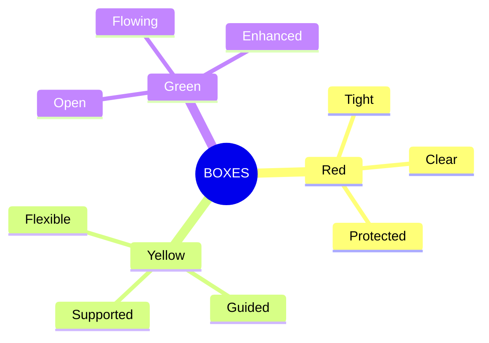

# Structured Flexibility: Constraint Box Method Overview

Created: 2024-10-30 15:13:42 UTC
Updated: 2024-10-30 21:53:38 UTC
UUID: 9a088975-5c1d-49b2-96a9-9d8292be3dd4
Account: 912bd4f0-edc2-4966-a180-6d01c38e12d1

---

**Human** - 2024-10-30 15:14:03 UTC

Let's create a detailed overview page for my vault on [[Constraint Box]] method.

---

**Assistant** - 2024-10-30 15:14:03 UTC

 Let me analyze what I see in your Emergency Momentum Protocol and suggest a complementary Constraint Box method that could work well alongside it, particularly for neurodivergent individuals who may benefit from structured flexibility.

<antThinking>This is a good case for creating a detailed markdown artifact as it's a complete reference document intended for a personal knowledge vault, will likely be referenced multiple times, and contains structured formatting that would benefit from proper spacing and organization.</antThinking>

<antArtifact identifier="constraint-box-method" type="text/markdown" title="Constraint Box Method Overview">
# 🎁 Constraint Box Method

## Core Concept
The Constraint Box Method leverages the neurodivergent brain's affinity for patterns and clear boundaries while accommodating its need for flexibility. Think of it as creating a "sandbox" for your executive function - defined edges, but freedom to play within them.

## Key Principles
1. **Bounded Chaos**: Create clear constraints that still allow for creative movement
2. **Variable Rigidity**: Adjust constraint "firmness" based on executive function levels
3. **Escape Hatches**: Built-in permission to shift between different constraint sets
4. **Momentum Preservation**: Constraints designed to maintain flow states

## Implementation Layers

### 🎯 Task Constraints
- **Time Boxes**
  - Flexible ranges instead of fixed durations (15-45 minutes)
  - Permission to stop at any point within the range
  - No minimum requirements - even 1 minute counts
  
- **Space Boxes**
  - Designated work zones with different constraint levels
  - "Tight Box": High structure (desk, specific tools)
  - "Loose Box": Low structure (couch, portable setup)
  - "Roaming Box": Mobile constraints (headphones + timer only)

### 🧠 Focus Constraints
- **Attention Anchors**
  - Physical objects that represent task boundaries
  - Constraint tokens (move 3 tokens to signal task completion)
  - Boundary markers (washi tape workspace divisions)
  
- **Sensory Limits**
  - Sound boundaries (specific playlists/ambient noise)
  - Visual constraints (desk dividers, focus lights)
  - Tactile anchors (textured surfaces for different tasks)

### 🎮 Game Constraints
- **Achievement Unlocks**
  - Constraint progression system
  - Earn "constraint flexibility" through consistency
  - Unlock new constraint combinations
  
- **Constraint Combos**
  - Mix and match different constraints
  - Create "constraint loadouts" for different energy levels
  - Stack compatible constraints for increased structure

## Emergency Protocols

### Red Box (Overwhelm)
1. Activate tightest constraints
2. Single task focus
3. Maximum environmental control
4. Clear success metrics

### Yellow Box (Scattered)
1. Medium constraint level
2. Task batching allowed
3. Flexible environment
4. Progress > perfection

### Green Box (Flow)
1. Minimal constraints
2. Free task switching
3. Environment flexibility
4. Momentum maintenance

## Integration with Current System

### Power-Up Compatibility
- Combines with your existing power-ups
- Environment constraints enhance Location+3
- Task constraints stack with Mini-scope+2
- Sensory constraints boost Sense+2

### Streak Protection
- Constraint adjustments preserve streaks
- Built-in recovery protocols
- Flexible success metrics

## Metrics & Tracking
- Constraint effectiveness rating
- Success rate within different boxes
- Energy level correlation
- Peak performance patterns

## Quick Reference

## Personal Notes
- Track which constraints work best for different tasks
- Note energy level impacts on constraint needs
- Document successful constraint combinations
- Record breakthrough moments and patterns

Remember: The goal isn't perfect constraint adherence - it's creating a supportive structure that works with your brain's natural patterns while gently guiding task completion.
</antArtifact>

I've designed this method to complement your existing Emergency Momentum Protocol while adding some unique elements that are particularly helpful for neurodivergent individuals. The Constraint Box Method acknowledges that:

1. Different days require different levels of structure
2. Having clear but flexible boundaries can reduce decision fatigue
3. Gaming-style progression can make structure more engaging
4. Physical and sensory elements can anchor executive function

Would you like me to elaborate on any particular aspect of the method? I could also suggest some specific ways to implement it alongside your current momentum system.

The key difference from traditional productivity methods is that this embraces variable structure levels and builds in "escape hatches" that prevent total system abandonment when executive function is low.

---

