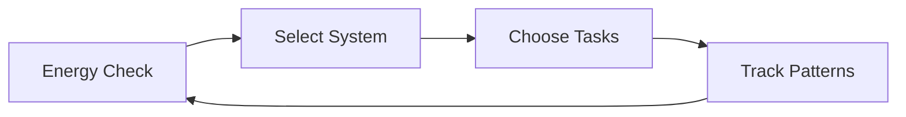
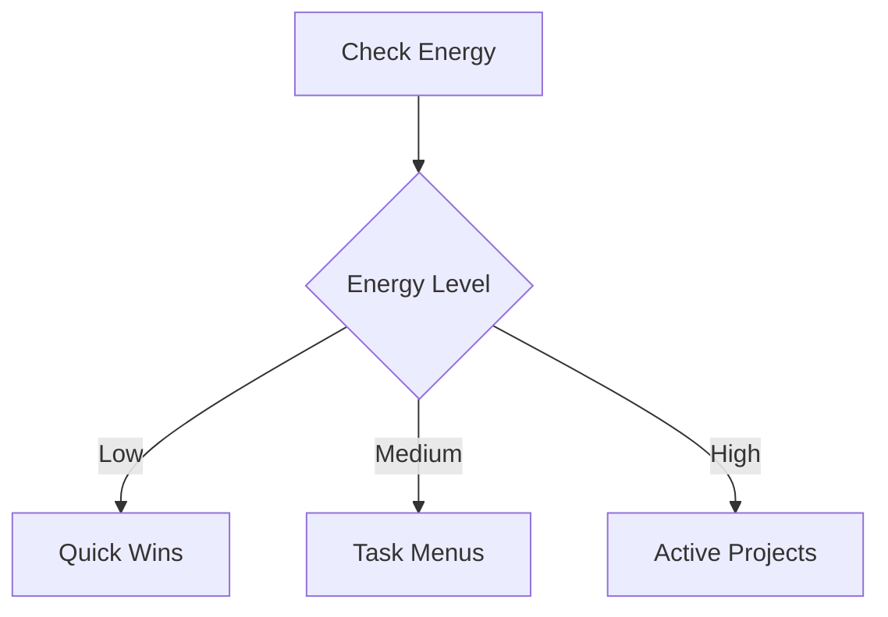

# 🧠 Executive Function Support System

## 🚀 Quick Access
### Emergency Tools
- [[Emergency Task Start Protocol|🆘 Emergency Start]]
- [[Current Energy State|⚡ Energy Check]]
- [[Quick Wins List|✅ Quick Wins]]
- [[Crisis Management|🛟 Crisis Help]]

### Daily Essentials
- [[Task Menus|📋 Today's Tasks]]
- [[Energy States|🔋 Energy Guide]]
- [[Pattern Recognition|🔄 Track Patterns]]
- [[System Maintenance|🛠️ Maintenance]]

## 📊 Core Systems

### Energy Management
- [[Energy States]]
  - [[Current Energy State]]
  - [[Energy Patterns]]
  - State Transitions
    - [[Zombie Mode]]
    - [[Spark Mode]]
    - [[Hyperfocus Mode]]

### Task Systems
- [[Task Management Systems]]
  - [[Quick Wins List]]
  - [[Task Menus]]
  - [[Active Projects]]
  - [[Task Patterns]]

### Support Networks
- [[System Maintenance]]
  - [[Personal Maintenance]]
  - [[Pattern Recognition]]
  - [[Crisis Management]]
  - [[Environmental Support]]

## 🔄 Daily Workflows

### Energy-Based Workflows


### Task Management Flow


## 📱 Quick Reference
- [[Quick Reference Cards]]
  - Energy States Card
  - Emergency Start Card
  - Transition Protocols
  - Crisis Response

## 📈 Pattern Recognition
- [[Pattern Recognition MOC]]
  - [[Energy Patterns]]
  - [[Task Patterns]]
  - [[System Patterns]]
  - [[Pattern Library]]

## 🛠️ Maintenance Hub
- [[System Maintenance]]
  - Daily Check-ins
  - Weekly Reviews
  - Monthly Audits
  - Emergency Repairs

## 📝 Templates
### Reviews
- [[Daily Review Template]]
- [[Weekly Review Template]]
- [[Monthly Review Template]]

### Tracking
- [[Energy Tracking Template]]
- [[Task Template]]
- [[Pattern Tracking Template]]

## 🎯 Implementation Guides
- [[Getting Started Guide]]
- [[System Setup Guide]]
- [[Crisis Response Guide]]
- [[Pattern Recognition Guide]]

## 🔍 Meta
- [[About This System]]
- [[System Updates]]
- [[Known Issues]]
- [[Feature Requests]]

## 🔗 External Resources
- [[Body Doubling Resources]]
- [[ADHD Support Tools]]
- [[Autism Support Tools]]
- [[Crisis Support Links]]

## 📊 Statistics
```dataviewjs
// Example dataview for system usage
// - Task completion rates
// - Energy pattern trends
// - System effectiveness metrics
```

## 🎨 CSS Snippets
```markdown
Available Themes:
- Low Sensory Theme
- High Contrast Theme
- Mobile Optimized
- Focus Mode
```

Would you like me to:
1. Add more specific sections or categories?
2. Create detailed dataview queries for the statistics section?
3. Develop specific implementation guides?
4. Add more workflow diagrams?

This MOC is designed to work both as a functional dashboard in Obsidian and an attractive landing page in Quartz, with clear navigation paths for both new and experienced users. It maintains all the system connections while presenting them in an accessible format.
