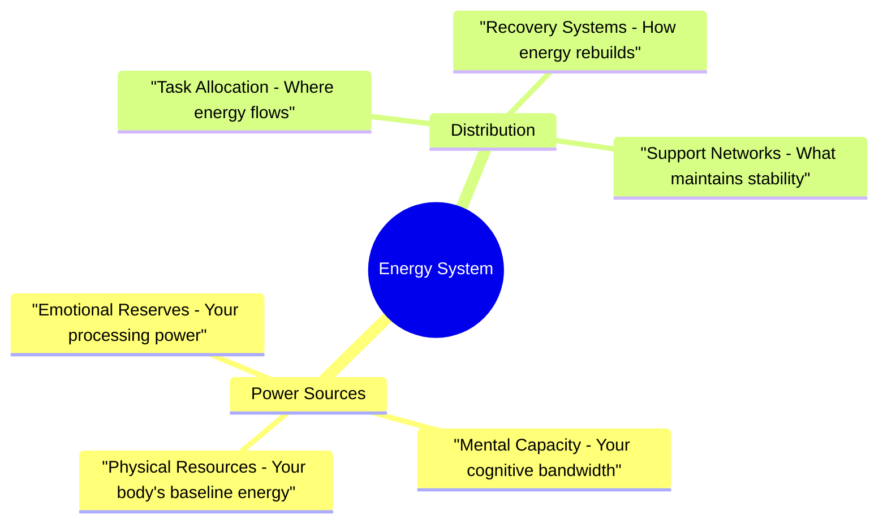

> [!tip] Your Energy is More Than Just Being "On" or "Off"
> Traditional productivity advice treats everyone's energy like a simple battery - you're either charged or depleted. But your neurodivergent brain operates more like a sophisticated power grid, with multiple systems that can be understood, supported, and optimized to work with your natural patterns.

## Understanding Your Power Grid

Your brain's energy system is a complex network of interconnected resources. Each part of this network influences how effectively you can engage with tasks, process information, and navigate your day. When one system is overtaxed, others often try to compensate, leading to uneven energy distribution and potential burnout.

## Energy Distribution Networks

Your brain's power grid doesn't just generate energy - it needs to effectively distribute that power where it's needed. This distribution system determines how well you can access and utilize your available resources throughout the day.

The Executive Function Network handles task initiation, organization, and completion. When this network is well-supported, you can more easily start tasks, maintain focus, and follow through to completion. This system requires clear pathways and regular maintenance to function optimally.

The Emotional Regulation Circuit manages your response to stress, social interactions, and internal processing needs. This system needs balanced power distribution to maintain stability while handling both expected and unexpected emotional demands.

The Sensory Processing Network filters and manages environmental input, controlling how much sensory information your brain needs to process at any given time. When this network is overwhelmed, other systems often experience power drains as they try to compensate.

## Working With Your Natural Cycles

Your energy isn't meant to remain constant throughout the day. Understanding and working with your natural cycles helps you maintain stable power distribution while avoiding system overload.

Generation Cycles occur when your brain is actively creating and building energy through engagement with tasks, interests, or activities that energize you. During these periods, your systems can more easily handle complex tasks and new information.

Distribution Cycles involve actively using and directing your energy across different demands. These cycles require careful monitoring to ensure you're not depleting resources faster than they can be replenished.

Recovery Cycles are critical periods where your systems need to reset and recharge. These aren't just about rest - they're active recovery periods that help maintain long-term system stability.

## System Management Protocols

Managing your energy effectively requires understanding how different tasks draw on your available resources. A complex project might require high mental energy but lower physical demands, while social interactions might heavily tax both emotional and sensory processing systems.

> [!multi-column]
>> [!warning] Task Energy Assessment
>> Consider how each activity draws on your different energy systems. Writing a report might need focused mental energy and minimal physical resources. Group meetings could require both social energy reserves and sensory processing power.
>
>> [!test] Resource Distribution
>> Match tasks to your current energy availability. When mental resources are low but physical energy is high, focus on movement-based activities. If emotional energy is depleted, prioritize solo tasks that don't require social interaction.
>
>> [!list] System Maintenance
>> Regular assessment helps you understand your patterns and adjust your approach. Track which activities drain or energize different systems, and use this information to plan more effective task distribution.

## Recovery and Reset Protocols

When your energy systems signal distress, having clear recovery protocols becomes essential. These aren't just emergency responses - they're part of maintaining a healthy, sustainable energy management system.

The Immediate Reset Protocol focuses on quick stabilization when you notice early warning signs of system strain:

1. Pause current tasks and assess which energy systems are showing stress signals
2. Activate appropriate recovery tools from your [[✅ Quick Wins List - Your Momentum-Building Toolkit]]
3. Implement gentle regulation activities that don't tax already strained systems
4. Begin gradual return to activity once stability improves

The Comprehensive Reset Protocol helps rebuild capacity after larger energy expenditures:

1. Create protected recovery time to allow full system reset
2. Use environmental supports to reduce additional energy demands
3. Gradually reintroduce activities as energy systems show improvement
4. Document effective recovery strategies for future reference

## Building Long-Term Resilience

Sustainable energy management isn't just about daily operations - it's about building systems that support your brain's natural patterns while developing greater resilience over time.

Regular pattern assessment helps you understand how your energy systems respond to different demands. This isn't about judging or forcing change - it's about gathering information that helps you work more effectively with your natural rhythms.

Support system development involves creating and maintaining tools and strategies that help regulate your energy flow. This includes environmental adjustments, task management systems, and social support networks that understand and respect your energy needs.

## Related Support Systems
[[🔋 Energy States - Understanding Your Brain's Power Management System]] | [[🏠 Environmental Support - Designing Your Productivity Ecosystem]] | [[🧠 The Unseen Guide - Unmasking Your Productivity Patterns 🔓]] | [[🚨 The Momentum Activation Protocol - Navigating Task Initiation Challenges]]
