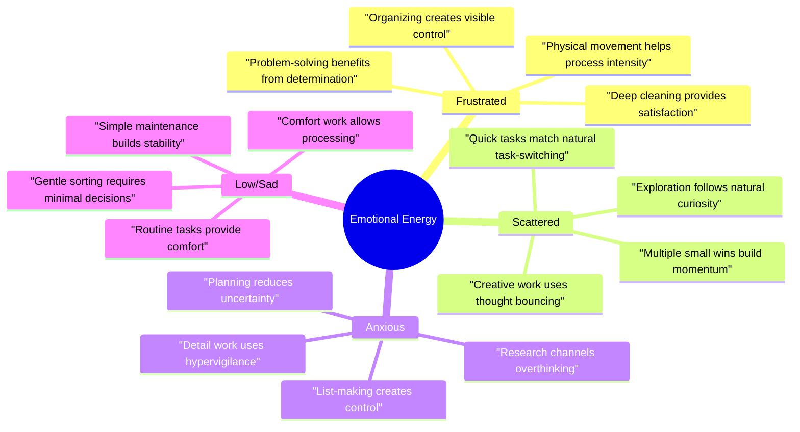

> [!tip] Quick Start Guide
> When you're feeling overwhelmed and need to get started:
> 1. Take a moment to identify your current emotional state - are you frustrated, scattered, anxious, or low energy?
> 2. Find your matching state in the guide below
> 3. Choose one task that fits your energy - start with the smallest possible action
> 4. Gather any listed support tools that help make the task easier
> 5. Set a timer for just 10 minutes and begin - you can always extend if it's working

## Understanding the Bridge Concept

The Emotion-Task Bridge isn't just about matching feelings to tasks - it's about understanding how different emotional states create different kinds of mental and physical energy that we can actually use. Instead of fighting against strong emotions or waiting for the "right" mindset, we learn to work with whatever state we're in.



## Energy States Explained

### 🔥 Frustrated Energy: Harnessing the Fire

When frustration builds up, it creates a restless, powerful energy that needs an outlet. This state actually gives us access to determination and physical drive that can be incredibly productive when channeled correctly.

**Perfect Tasks:**
- Deep cleaning that requires physical effort - scrubbing, reorganizing furniture, yard work
- Tackling stuck projects that need breakthrough force
- Organizing spaces that have been bothering you
- Exercise or movement that uses the energy constructively

**Why These Work:**
The physical movement helps process the emotional intensity while giving you visible results. The sense of making immediate, tangible change helps satisfy the need to DO something about your frustration.

**Support Needed:**
- Physical space to move safely
- Clear boundaries about what you will/won't tackle
- A way to track visible progress
- Permission to take breaks if intensity gets too high

### ⚡ Scattered Energy: Riding the Lightning

That scattered, bouncing-off-the-walls feeling isn't wrong or broken - it's a state of high mental mobility that can be perfect for certain kinds of work. Instead of trying to force focus, we can use the natural movement between ideas.

**Perfect Tasks:**
- Creative projects that benefit from unusual connections
- Quick task batches where switching is a feature, not a bug
- Brainstorming sessions that need free-flowing ideas
- Exploration of new topics or systems

**Why These Work:**
Your mind is already moving between ideas quickly - these tasks make that movement useful instead of frustrating. The variety keeps engagement while still accomplishing goals.

**Support Needed:**
- Capture tools for quick ideas (notebook, voice recorder)
- Timer boundaries to prevent getting lost
- Pre-made list of small tasks to switch between
- Something to fidget with while thinking

### 🌀 Anxious Energy: Focusing the Spiral

Anxiety often comes with hypervigilance and a need to control details. Instead of fighting this, we can channel it into tasks that actually benefit from this intense attention and planning energy.

**Perfect Tasks:**
- Detailed research on topics you need to understand
- Creating systems and organizing information
- Making comprehensive lists and plans
- Double-checking important work

**Why These Work:**
The natural thoroughness of anxious energy helps ensure nothing is missed, while the productive action helps reduce anxiety about uncertainty.

**Support Needed:**
- Quiet space to think clearly
- Comfort items or stim toys
- Time limits to prevent overthinking
- Maybe a body double for grounding

### 🌧️ Low/Sad Energy: Gentle Growth

During low energy periods, the goal isn't to force high performance but to maintain gentle movement forward. These tasks should feel like a warm blanket - comforting and manageable.

**Perfect Tasks:**
- Routine tasks that don't require decisions
- Simple sorting or organizing
- Basic maintenance work
- Comfort-zone activities that still produce results

**Why These Work:**
These tasks provide structure and small wins without requiring large energy output. They help maintain function while respecting your current capacity.

**Support Needed:**
- Cozy, comfortable environment
- Very low pressure
- List of pre-decided easy wins
- Understanding support person if needed

## Implementation Guide

### Building Your Task Bank

Create a personal reference of tasks that match each energy state. For each task, note:

```markdown
Task Name: [Specific action]
Energy Match: [Which state works best]
Time Needed: [Realistic estimate]
Tools Required: [Physical items needed]
Support Needed: [Environment, people, etc.]
Completion Signals: [How you know it's done]
Success Patterns: [What made it work before]
```

### Daily Practice

1. **Regular Check-ins:**
   - Morning energy assessment
   - Mid-day adjustment if needed
   - Evening reflection on what worked

2. **Environment Setup:**
   - Prepare spaces for different energy states
   - Keep support tools accessible
   - Maintain task lists for each state

3. **Pattern Recognition:**
   - Track which tasks work best when
   - Note environmental factors
   - Record successful combinations

> [!warning] Important Reminders
> - This system is about options, not obligations
> - Start with the smallest possible action
> - Adjust tasks to match your actual capacity
> - Keep emergency protocols accessible
> - Track what works for future reference

## Related Notes
- [[🔋 Energy States - Understanding Your Brain's Power Management System]] - Detailed guide to recognizing and working with different energy levels
- [[Task Management Systems]] - Additional frameworks for organizing work
- [[Pattern Recognition]] - How to track and learn from what works
- [[Support Network]] - Building and maintaining help systems

Remember: The goal isn't to be productive all the time - it's to have options for channeling energy when you're ready to act, and permission to rest when you're not.
