> [!info]+ Purpose
> Task Menus are an adaptive system designed to reduce decision fatigue and match tasks to your current
> energy state. By framing tasks as a "menu," you can approach your day with clarity, choice, and compassion, 
> selecting what feels most achievable in the moment.

## 🧠 **Core Concept**

Imagine starting your day feeling scattered and unsure where to begin. You check in with your energy state—you're hovering somewhere between low and moderate energy. Instead of staring blankly at your to-do list, you open your Task Menu.

In Zombie Mode, you might start with a simple Quick Win—a 5-minute task like clearing your desk or responding to one email. As your energy starts to build, you move into Spark Mode, staging materials for your next project or jotting down some creative ideas. By the afternoon, you're hitting Hyperfocus Mode, fully immersed in deep, focused work on a meaningful project.

The Task Menu system isn’t just about checking off tasks—it’s about creating flow, honoring your energy levels, and making progress without guilt or overwhelm. Our brains, especially neurodivergent ones, often struggle with task initiation and decision overload. Task Menus simplify this process by offering pre-curated options tailored to your energy state.

Instead of pushing through mismatched tasks, you can "order" what aligns with your mental and physical capacity.

```mermaid
graph TD
    A[Energy State Check] --> B{Which Menu?}
    B -->|🧟‍♂️ Zombie Mode| C[Gentle, Minimal Tasks]
    B -->|⚡ Spark Mode| D[Flexible, Dynamic Tasks]
    B -->|🚀 Hyperfocus Mode| E[Deep, Immersive Tasks]
    C --> F[Build Momentum with Micro-Tasks]
    D --> G[Engage Creativity & Problem-Solving]
    E --> H[Focus Intensely on High-Impact Work]
```

---

> [!note]+ Start with the Smallest Action
> Use **[[🔋 Energy States - Understanding Your Brain's Power Management System]]** to identify your current state, then select from the corresponding menu.

## 📖 **Task Menus Overview**
Each Task Menu is designed to match a specific energy state. Below are summaries and links to individual Task Menu pages for deeper exploration.

>[!multi-column]
>> ### [[🧟‍♂️ Zombie Mode Menu]]
>> - Gentle, minimal tasks.
>> - Designed for low-energy, high-sensitivity moments.
>> - Focus on small, achievable steps.
>
>> ### [[⚡ Spark Mode Menu]]
>> - Flexible, dynamic tasks.
>> - Ideal for fluctuating energy and building momentum.
>> - Great for creative exploration and mid-level focus work.
>
>> ### [[🚀 Hyperfocus Mode Menu]]
>> - Deep, immersive tasks.
>> - Best for high-energy, fully engaged states.
>> - Suitable for intense focus on complex tasks.

Explore each menu to better understand how to align tasks with your current energy state.

---

## 📅 **Menu Management**
Menu Management is about keeping your Task Menus fresh, relevant, and aligned with your energy and priorities. Think of it as fine-tuning a recipe to suit your current tastes—sometimes you’ll need something quick and light, other times something more substantial.

### 🗓️ **Daily Specials**
Daily Specials are your go-to tasks for the day—things that are time-sensitive, align with your current energy, or offer quick momentum boosts.

- **Example 1:** You have a report due today, so your Daily Special might focus on pulling together final edits and submitting it.
- **Example 2:** A burst of creative energy hits in the morning, so you prioritize drafting ideas for an upcoming project.

### 🌱 **Seasonal Rotation**
Tasks, like seasons, have natural cycles. Seasonal Rotation ensures your menus reflect shifting energy levels, project timelines, and evolving interests.

- **Example 1:** During a busy work season, your menu might lean heavily on maintenance tasks and quick wins.
- **Example 2:** In quieter months, you might focus on deep creative projects or skill development.

### 👨‍🍳 **Chef's Recommendations**
Sometimes, it helps to have a guiding suggestion when decision fatigue sets in. Chef’s Recommendations are pre-curated options based on energy levels, recent momentum, and available resources.

- **Example 1:** After completing three quick wins, your Chef's Recommendation might suggest tackling a mid-level Spark Mode task.
- **Example 2:** If your environment feels chaotic, the recommendation might focus on tasks like clearing your workspace or organizing tools.

These sections aren’t rigid rules—they’re adaptable tools to keep your menus vibrant and effective. Experiment, adjust, and refine them to fit your unique rhythms.

---

## 🛠️ **Implementation Guide**
>[!note]
> **Next Steps:** Explore individual Task Menus, experiment with daily specials, and refine your approach using insights from **[[🧠 The Unseen Guide - Unmasking Your Productivity Patterns 🔓]]**

The Implementation Guide is your toolkit for creating and using Task Menus effectively. This section isn’t just about filling out templates—it’s about building a system that feels intuitive and easy to navigate. Think of it as your kitchen setup: clear tools, simple instructions, and enough flexibility to adapt on the fly.

When used regularly, Task Menus become a natural part of your workflow, reducing decision fatigue and making task initiation smoother. Whether you’re setting up a daily plan or troubleshooting in the moment, this guide is here to help you build momentum and keep things moving.

## 🔗 **Integration Points**

> [!multi-column]
> 
>> ### [[✅ Quick Wins List - Your Momentum-Building Toolkit]]
>> 
>> - Immediate, low-barrier tasks.
>>     
>> - Build quick momentum.
>>     
> 
>> ### [[🚨 The Momentum Activation Protocol - Navigating Task Initiation Challenges]]
>> 
>> - Tools to overcome inertia.
>>     
>> - Initiate tasks smoothly.
>>     
>
>> ### [[🧠 The Unseen Guide - Unmasking Your Productivity Patterns 🔓]]
>> 
>> - Long-term optimization.
>>     
>> - Identify recurring patterns.
>>     
> 
>> ### [[🔋 Energy States - Understanding Your Brain's Power Management System]]
>> 
>> - Self-awareness framework.
>>     
>> - Align tasks with energy levels.
>>
## 🗂️ **Related Notes**
**[[Task Management Systems]]** | **[[Energy Management]]** | **[[Pattern Recognition]]**
