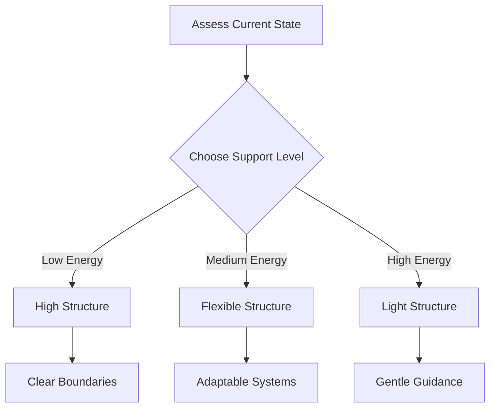

> [!tip] Core Concept
> Think of constraints not as restrictions, but as supportive scaffolding for your mind. Like a climbing vine needs a trellis to reach its full height, our brains often work best with thoughtful structures that support rather than limit our growth.

## Understanding Dynamic Constraints

The Constraint Box Method works with your neurodivergent brain's natural patterns while providing flexible structure for different energy states and needs. Think of it like having a set of adaptable tools that can be adjusted based on your current capacity and goals.

## Core Principles

- **Bounded Flexibility:** Create clear but adjustable boundaries that help direct your focus and energy. Like river banks that guide water flow, these boundaries help channel your attention while allowing natural movement within them. This might mean having designated work zones with clear visual markers, using time blocks that can expand or contract based on your needs, or developing routines that have built-in flexibility points.

- **Energy-Matched Support:** Align your constraint systems with your current [[🔋 Energy States - Understanding Your Brain's Power Management System|energy state]]. This means having different levels of structure ready for different states: tight and supportive for low energy, flexible and adaptable for medium energy, and light but present for high energy periods. Think of it like having different levels of scaffolding that can be adjusted as needed.

- **Permission Framework:** Build explicit permission to adjust or change constraints into your system. Rather than seeing changes as failures, treat them as natural transitions that are part of the process. This includes having clear protocols for when and how to modify constraints, recognizing early signs that adjustments are needed, and maintaining a non-judgmental approach to system changes.

## Implementation Layers

### Environmental Constraints

- **Workspace Zoning:** Create clearly defined areas that signal different types of work to your brain. Use physical markers like desk mats, lighting changes, or actual dividers to separate spaces for focused work, quick tasks, and breaks. This isn't about having perfectly separate rooms - even small spaces can be divided into functional zones that help your brain recognize what type of work happens where.

- **Tool Organization:** Develop systems for organizing and accessing your support tools based on current needs. This means having emergency support kits easily accessible for low energy states, flexible tool arrangements for medium energy periods, and minimal but effective setups for high focus times. Consider using clear containers, labeled spaces, or color-coding to make tool access intuitive.

- **Sensory Management:** Create intentional control over your sensory environment. This includes having different sound options (noise-canceling headphones, specific playlists, white noise), lighting controls (task lights, ambient options, natural light management), and comfort tools (fidget items, textured surfaces, comfort objects) readily available but organized.

### Time Constraints

- **Flexible Time Blocks:** Match your time structures to your energy state and task requirements. This means having options ranging from very short intervals (5-15 minutes) for low energy states to longer blocks (30-90 minutes) for high focus periods. Use visual timers that don't require active monitoring and allow natural adjustment of time blocks based on your engagement level.

- **Transition Protocols:** Develop clear but gentle ways to move between different activities. This might include physical movement patterns, environmental changes (lighting, sound, position), or small rituals that help your brain recognize and adapt to transitions. Link these with your [[🔄 Task Momentum - Using Movement to Overcome Inertia|momentum maintenance]] strategies.

- **Progress Tracking:** Create visible ways to monitor time use that don't induce stress. This could involve using physical tokens that move between "time zones" on your desk, digital tools that track patterns without judgment, or simple logging systems that help you understand your natural rhythms.

### Focus Constraints

- **Attention Structures:** Develop systems that help direct and maintain focus without requiring constant conscious effort. This includes using physical markers or tokens that represent task progress, creating visual maps of work flow, and establishing clear signals for different types of focus needs. Think of these as external representations of internal processes.

- **Task Containers:** Create clear boundaries around different types of tasks while maintaining flexibility in how they're approached. This might mean having specific setups for different categories of work, using visual organizers that show task relationships, or developing protocols for handling task transitions. Connect these with your [[🍽️ Task Menus|Task Menu]] system for additional support.

- **Safety Systems:** Build in protocols for handling focus disruptions or energy changes. This includes having clear steps for what to do when focus breaks, maintaining easy access to [[✅ Quick Wins List - Your Momentum-Building Toolkit|Quick Wins]] for rebuilding momentum, and creating gentle ways to redirect attention when needed.

### State-Based Protocols

Each energy state needs its own level of constraint support:

**Zombie Mode Structure:**
- Clear, simple boundaries that reduce decision load
- Minimal required movements or transitions
- Highly visible support tools and progress markers
- Short time blocks with built-in break protocols
- Direct access to emergency support strategies

**Spark Mode Support:**
- Flexible boundaries that allow natural task switching
- Multiple active zones for different types of work
- Accessible but organized tool arrays
- Variable time blocks that can expand or contract
- Easy transitions between different activities

**Hyperfocus Mode Guidance:**
- Light boundaries that maintain safety without restricting flow
- Expanded workspace access with subtle organization
- Minimal but effective progress tracking
- Extended time containers with gentle awareness cues
- Support for deep engagement while maintaining orientation

## Integration Points

- **[[🏠 Environmental Support - Designing Your Productivity Ecosystem|Environment Anchors]]:** Your constraint systems should work seamlessly with your environmental support setup, creating mutual reinforcement.

- **[[Pattern Recognition]]:** Track which constraints work best in different situations, helping you refine your system over time.

- **[[🚨 The Momentum Activation Protocol - Navigating Task Initiation Challenges|Momentum Protocol]]:** Use constraints as launching points for action, reducing startup friction.

## System Maintenance

- **Regular Review:** Set up gentle checkpoints to evaluate how your constraints are working. This isn't about harsh judgment but curious observation of what supports you best.

- **Adjustment Protocols:** Develop clear steps for modifying constraints when needed, making system changes feel safe and supported.

- **Pattern Recognition:** Keep track of which constraints work best in different situations, building your personal support manual over time.

## Remember

Constraints aren't about limitation - they're about creating supportive structure that helps you work with your brain's natural patterns. Like a well-designed garden trellis, they should provide support while allowing natural growth and movement.

