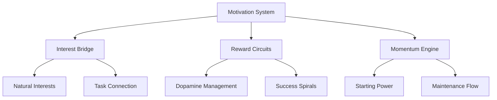

> [!tip] Motivation Isn't Just About Wanting It More
> Traditional advice treats motivation like a switch you can flip through sheer willpower. For neurodivergent brains, motivation is more like a complex engine that needs the right fuel, proper maintenance, and understanding of how all its parts work together.

## The Motivation Landscape

Motivation isn't a single force but a dynamic system of interconnected elements. Your brain's reward circuits, executive function, and emotional systems all play crucial roles in generating and maintaining motivation. Understanding these connections helps you build systems that work with your brain's natural patterns rather than fighting against them.

## Core Motivation Components

Your motivation system relies on three fundamental mechanisms that work together to create and sustain engagement. Each of these can be understood and optimized to better support your unique brain patterns.

The Interest Bridge connects tasks to your brain's natural engagement patterns. When we try to force motivation through pure willpower, we often hit walls of resistance. Instead, finding ways to link necessary tasks to existing interests creates natural pathways for engagement. This isn't about making everything fun - it's about finding genuine connections that your brain can recognize and respond to.

The Reward Circuit manages how your brain processes success and builds momentum. Neurodivergent brains often have unique reward processing patterns. Understanding your personal reward triggers helps you create more effective motivation loops. Small, immediate rewards often work better than distant, larger ones.

The Momentum Engine handles the transition from inertia to action. This system works best when you understand both your starting patterns and your maintenance needs. Different tasks and energy states require different momentum-building approaches, as outlined in [[🔄 Task Momentum - Using Movement to Overcome Inertia]].

## Building Your Motivation Framework

Creating effective motivation systems isn't about applying more pressure or higher stakes. It's about engineering environments and processes that naturally support engagement and momentum.

> [!multi-column]
>
>> ### Interest Alignment
>> Rather than forcing motivation, look for ways to connect tasks to existing interests. A tedious data entry job might become engaging when viewed as a pattern recognition challenge or system optimization opportunity.
>
>> ### Reward Engineering
>> Design reward systems that match your brain's processing patterns. Some people respond well to visual progress tracking, others to achievement unlocks, and still others to tangible rewards. The key is finding what genuinely registers as rewarding for your brain.
>
>> ### Momentum Management
>> Build systems that help you maintain movement once started. This often means breaking tasks into smaller segments, creating clear checkpoints, and having protocols for regaining momentum when it drops.

## Support Frameworks

Different types of tasks and states require different motivation approaches. Having multiple frameworks available helps you match your support to your current needs.

### The Gamification Framework
As detailed in [[⚡️ Productivity Pinball - Gamifying Your Workflow|⚡️ Productivity Pinball]], turning tasks into game-like challenges can create natural motivation hooks. This isn't about superficial point systems - it's about tapping into the core elements that make games engaging:

1. Clear feedback loops that help you track progress
2. Achievable challenges that build confidence
3. Multiple paths to success that honor different approaches
4. Built-in recovery mechanics for when things don't go as planned

### The Interest Spiral System
Building on your brain's natural engagement patterns:

1. Start with tasks that naturally draw your attention
2. Gradually bridge to connected but less engaging tasks
3. Use your heightened engagement state to tackle harder items
4. Document successful connections for future reference

### The Momentum Maintenance Protocol
Supporting sustained engagement through:

1. Strategic task staging using [[🍽️ Task Menus]]
2. Regular progress acknowledgment
3. Built-in recovery periods
4. Clear continuation points

## Crisis Response Tools

Even well-designed motivation systems sometimes falter. Having clear protocols for motivation crises helps prevent complete disengagement.

When motivation systems struggle:

1. Return to [[✅ Quick Wins List - Your Momentum-Building Toolkit|✅ Quick Wins List]] for immediate momentum
2. Activate [[🛟 Crisis Management - The Impossible Task Protocol|🛟 Crisis Management]] if needed
3. Use [[🎁 The Constraint Box Method - Structured Support for Your Mind|🎁 Constraint Box Method]] to reduce overwhelm
4. Engage [[🤝 Support Network - Building Your Circle of Strength|🤝 Support Network]] for additional momentum

## System Maintenance

Your motivation system needs regular attention to stay effective and aligned with your changing needs. This isn't about forcing consistency - it's about maintaining and evolving tools that support your engagement.

Regular System Check:
- Review what's working in your current motivation strategies
- Adjust frameworks that no longer serve your needs
- Update reward systems based on changing patterns
- Document new interest connections and momentum tools

Evolution Process:
- Start with motivation tools that feel natural
- Gradually expand your framework options
- Remove elements that create resistance
- Keep refining based on real-world results

## Related Systems
[[🔋 Energy States - Understanding Your Brain's Power Management System|🔋 Energy States]] | [[🧠 The Unseen Guide - Unmasking Your Productivity Patterns 🔓|Pattern Recognition]] | [[🚨 The Momentum Activation Protocol - Navigating Task Initiation Challenges|🚨 The Momentum Activation Protocol]] | [[🌈 The Emotion-Task Bridge]]

