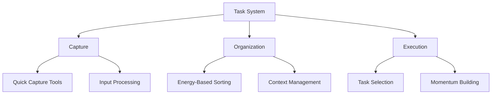

> [!tip] Your Tasks, Your Way
> Traditional task management systems assume everyone's brain works the same way. For neurodivergent minds, effective task management isn't about forcing yourself into rigid systems - it's about building flexible frameworks that work with your natural patterns of thinking and doing.

## Understanding Task Management Fundamentals

Task management isn't just about making lists or checking boxes. It's about creating a system that helps you navigate from intention to completion while honoring your brain's unique way of processing and executing. When we try to force ourselves into systems that fight our natural patterns, we often end up with more resistance than progress.

## Core System Components

Your task management system needs three fundamental elements working together to support your executive function effectively. Each component can be customized to match your thinking style and energy patterns.

The Capture System catches all incoming tasks, ideas, and responsibilities before they can overwhelm your working memory. This isn't about organizing yet - it's about creating reliable collection points that your brain can trust. When you know nothing will slip through the cracks, your mind can release the constant vigilance of trying to remember everything.

The Organization Framework helps sort and structure tasks in ways that make sense to your brain. This might mean organizing by energy level required, context needed, or project relationship. The key is finding categorization methods that feel natural to your thinking patterns rather than forcing yourself into traditional sorting systems.

The Execution Engine helps you move from planning to action. This involves tools and strategies for selecting tasks based on your current energy state, building momentum through strategic task sequencing, and maintaining progress even when executive function is challenging.

## Building Your System

Creating an effective task management system isn't about finding the perfect app or method - it's about understanding how your brain processes and executes tasks, then building supports around those natural patterns.

> [!multi-column]
>
>> ### Thinking Style Alignment
>> Some brains work best with visual systems like mind maps or kanban boards. Others prefer linear lists or calendar-based approaches. Your ideal system will match how your brain naturally organizes information and tracks progress.
>
>> ### Energy State Integration
>> Your system should work with your natural energy fluctuations, not against them. This means having different entry points and task selection methods based on your current [[🔋 Energy States|energy level]].
>
>> ### Support Tool Selection
>> Choose tools that reduce friction rather than adding complexity. The best task management tool is the one you'll actually use consistently, whether that's a simple notebook or a sophisticated digital system.

## Task Processing Protocols

Moving tasks from capture to completion requires clear protocols that support your executive function. These protocols create reliable pathways for processing information and taking action.

### The Quick Capture Protocol
When new tasks, ideas, or responsibilities emerge:

1. Get them out of your head immediately using whatever capture tool is closest
2. Trust that your system will handle the organizing later
3. Focus on speed and reliability of capture rather than perfect organization
4. Process your capture points regularly using the organization protocol

### The Organization Protocol
During designated processing times:

1. Review all capture points without trying to act on tasks yet
2. Sort items based on your chosen organization framework
3. Break down complex tasks into manageable steps
4. Assign context and energy requirements to help with future task selection

### The Execution Protocol
When it's time to take action:

1. Check your current energy state using [[🔋 Energy States - Understanding Your Brain's Power Management System|🔋 Energy States]]
2. Select tasks from your [[🍽️ Task Menus]] that match your capacity
3. Use [[🔄 Task Momentum - Using Movement to Overcome Inertia|🔄 Task Momentum]] principles to maintain progress
	1. Implement [[🎁 The Constraint Box Method - Structured Support for Your Mind|🎁 Constraint Box Method]] for focus when needed

## Crisis Management Support

Even the best task management system needs protocols for handling overwhelm and executive function challenges. Having these supports in place helps prevent complete system breakdown during difficult periods.

When your task management system feels overwhelming:

1. Activate your [[🛟 Crisis Management - The Impossible Task Protocol|🛟 Crisis Management]] protocol
2. Return to your [[✅ Quick Wins List - Your Momentum-Building Toolkit|✅ Quick Wins List]] for manageable progress
3. Use [[🏠 Environmental Support - Designing Your Productivity Ecosystem|🏠 Environmental Support]] to reduce additional demands
4. Engage your [[🤝 Support Network - Building Your Circle of Strength|🤝 Support Network]] if needed

## System Maintenance

A reliable task management system requires regular maintenance to stay effective and aligned with your needs. This isn't about perfection - it's about keeping your system functional and supportive.

Regular Review Process:
- Check that your capture points are still working effectively
- Update organization methods that no longer serve your needs
- Refine execution protocols based on what you've learned
- Document patterns using [[🧠 The Unseen Guide - Unmasking Your Productivity Patterns 🔓|Pattern Recognition]] tools

System Evolution Steps:
- Start with basic components that feel manageable
- Add features gradually as you build comfort and trust
- Remove elements that create more friction than benefit
- Keep refining based on real-world usage patterns

## Related Systems
[[🔋 Energy States - Understanding Your Brain's Power Management System|🔋 Energy States]] | [[🍽️ Task Menus]] | [[🧠 The Unseen Guide - Unmasking Your Productivity Patterns 🔓|Pattern Recognition]] | [[🚨 The Momentum Activation Protocol - Navigating Task Initiation Challenges|🚨 The Momentum Activation Protocol]]
