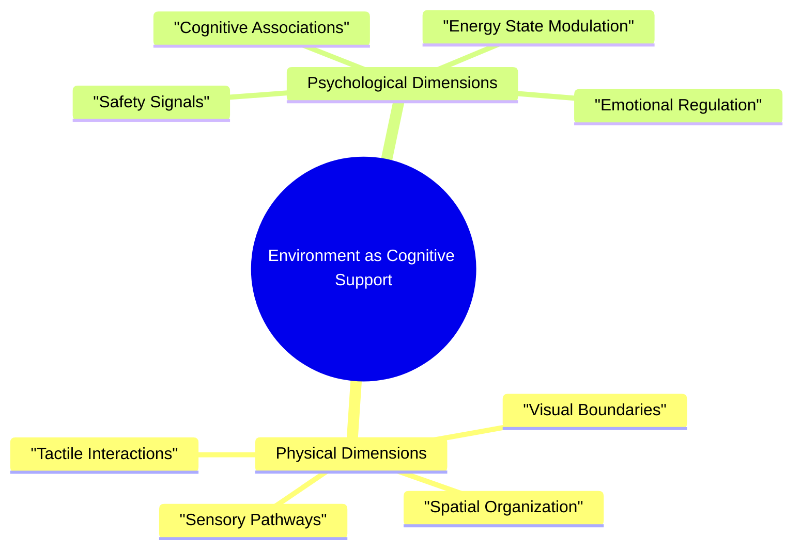

> [!tip] Your Environment is an Extension of Your Cognitive System
> Physical spaces are not just backgrounds - they are active participants in your neurological processes, capable of supporting or hindering your unique way of thinking and working.

## The Language of Spatial Intelligence

Our environments speak a complex language that our brains constantly interpret. For neurodivergent individuals, this language is particularly nuanced. A room is never just a room - it's a dynamic ecosystem that can either amplify our cognitive abilities or create invisible barriers.

## Understanding Cognitive Zones

Every space in your environment can be intentionally designed to support different cognitive states and tasks. These are not rigid containers, but fluid ecosystems that adapt to your changing needs.

### The Focus Zone: Cultivating Cognitive Clarity

Imagine a space that doesn't fight for your attention, but instead creates a gentle container for concentration. The Focus Zone is about strategic simplicity - not sterile minimalism, but intentional curation.

**Core Principles:**
- Visual calm that reduces cognitive noise
- Strategically placed essential tools
- Sensory management that supports concentration
- Comfort integrated with functionality

The magic isn't in perfection, but in creating an environment that whispers "focus" instead of shouting. A neutral color palette, carefully managed lighting, and a clear surface become invitations to engage with your most challenging work.

### The Creative Zone: Nurturing Possibility

Creativity requires a different kind of spatial support - one that celebrates connection, exploration, and the beautiful chaos of emerging ideas. This is not a neat, organized space, but a dynamic landscape of potential.

**Guiding Philosophy:**
- Multiple work surfaces that invite exploration
- Varied sensory inputs that spark curiosity
- Tools that support spontaneous thinking
- Physical space for mental and bodily movement

Here, a scattered sketch can live alongside a complex diagram. Textures, colors, and objects become prompts for mental exploration. The environment itself becomes a collaborator in the creative process.

### The Recovery Zone: Designing Restoration

Recovery is an active process of nervous system recalibration. This zone is about creating a space that offers safety, comfort, and gentle reset mechanisms.

**Restoration Strategies:**
- Sensory regulation tools
- Soft, predictable environmental cues
- Grounding objects and textures
- Controllable stimuli levels

More than a relaxation space, this is a deliberate ecosystem of emotional and neurological support. Weighted blankets, carefully chosen lighting, and personal comfort artifacts work together to create a sense of safety and potential renewal.

## Implementation: From Concept to Living System

### Zone Creation Process
Creating these spaces isn't about achieving perfection, but about developing a responsive, adaptive system:

1. **Space Assessment**
   Observe your current environment with curiosity. Where do you naturally gravitate? What creates friction? What supports your best moments?

2. **Intentional Design**
   Gather tools and create prototype zones. Treat this as an experiment, not a final solution. Your environment, like your brain, is always evolving.

3. **Transition Rituals**
   Develop gentle markers between zones. A specific item, a brief breathing exercise, or a deliberate physical movement can signal state changes.

## Flexible Navigation

The key is radical flexibility. Some days, your carefully designed zones might look completely different. Some days, you might need to break all the rules. That's not just okay - it's expected.

## Related Support Systems
- [[🔋 Energy States - Understanding Your Brain's Power Management System]]
- [[Task Management Systems]]
- [[🛟 Crisis Management - The Impossible Task Protocol]]
- [[🚨 The Momentum Activation Protocol - Navigating Task Initiation Challenges]]

Would you like to:
1. Assess your current environment?
2. Design your first support zone?
3. Explore transition strategies?
4. Reflect on your space's potential?

## Related
[[🏠 Environmental Support - Designing Your Productivity Ecosystem]] | [[Task Management Systems]] | [[Pattern Recognition]]
