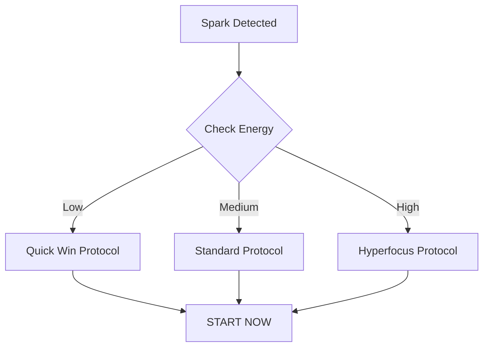

## Quick Access Protocol

> [!tip] A Gentle Approach to Getting Started
> This isn't about forcing yourself to be productive. It's about understanding the intricate dance of your brain's motivation systems and creating compassionate pathways forward.

## The Landscape of Starting

Have you ever found yourself frozen, staring at a task that feels impossibly complex? Maybe it's a simple email, a work project, or even just doing the dishes. Your brain knows what needs to be done, but something keeps you stuck - like an invisible force field preventing movement.

This is the terrain of task initiation, and it's far more complicated than most people realize. It's not about laziness or lack of willpower. It's about the complex neurological processes that determine how and when we can transform thought into action.

### The Hidden Complexity of "Just Starting"

Imagine your brain as a sophisticated computer system with multiple processors. Task initiation isn't a single-click operation - it's a complex negotiation between:
- Emotional state
- Available energy
- Sensory input
- Past experiences
- Current environmental conditions

When any of these systems are slightly out of alignment, the entire "start-up sequence" can grind to a halt.

## Energy Landscapes: Your Personal Activation Map

### 🧟‍♂️ The Zombie State: Minimum Viable Movement

You know this feeling. Your internal battery is hovering just above zero. The world feels heavy, and the idea of "doing something" seems like an elaborate fantasy.

**Survival Strategy:**
The goal here isn't productivity. It's maintaining connection and preventing complete shutdown. Your entire mission is to create the tiniest possible ripple of movement.

- **Micro-Commitment:** Find the absolute smallest action possible
  * Look at the task list
  * Touch one object related to the task
  * Breathe and acknowledge your current state

- **Gentleness is Your Superpower**
  * Set a timer for 5 minutes - maximum
  * Give yourself full permission to stop
  * No expectations, just gentle exploration

### ⚡ The Spark State: Engaging the Potential

This is when you feel a hint of energy. Not a full-blown motivational surge, but a slight electrical charge that suggests possibility.

**Activation Protocol:**
- **Energy Matching:** Carefully select a task that feels just barely possible
- **10-Minute Focused Burst**
  * Verbalize your intention out loud
  * Use a visual timer
  * Resist the urge to over-prepare
  * Start immediately after setting the timer

### 🚀 The Hyperfocus Hurricane: Riding the Intensity

When your brain decides to go into full-throttle mode, everything becomes possible - and potentially overwhelming.

**Intensity Management:**
- **Rapid Idea Capture:** Quickly dump all related thoughts
- **25-Minute Deep Dive**
  * Clear your immediate workspace
  * Embrace the intensity
  * Create clear start and stop boundaries
- **Transition Preparation:** Plan how you'll gracefully exit this state

## Emergency Override Strategies

### When You're Completely Frozen
Sometimes, the very act of starting feels impossible. Here's your emergency protocol:

1. Lower the bar to its absolute minimum
2. Say out loud: "I'll just look at this for a moment"
3. Touch one item related to the task
4. Set a 2-minute timer
5. Give yourself full permission to stop
## Related
[[🔋 Energy States - Understanding Your Brain's Power Management System|🔋 Energy States]] | [[✅ Quick Wins List - Your Momentum-Building Toolkit|✅ Quick Wins List]] | [[🎯 Task Management Systems - Building Your Personal Productivity Engine|🎯 Task Management Systems]]
