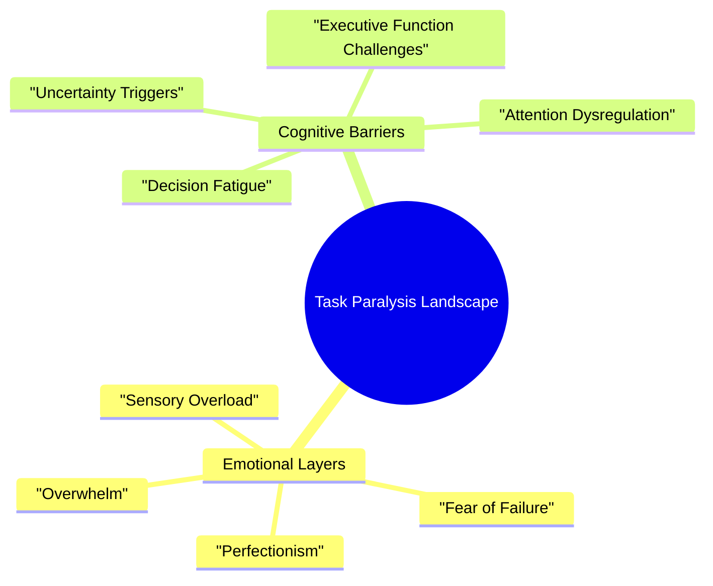

> [!tip] Compassionate Crisis Support
> **Remember:** You are not broken. You are navigating a challenging moment, and this protocol is here to support you exactly as you are right now.

## Understanding Task Paralysis

Task paralysis isn't a failure of willpower - it's a complex neurological response when your brain feels overwhelmed. Think of it like a computer system that's encountered too many conflicting commands and temporarily freezes. You're not stuck because you're lazy or incapable - you're experiencing a very real cognitive challenge that requires a gentle, strategic approach.

## The Impossible Task Assessment

### Decoding the Impossible

Before attempting to tackle the task, take a moment to understand what's making it feel insurmountable. This isn't about criticism - it's about compassionate investigation.

**Critical Assessment Questions:**
1. **What Makes This Task Feel Impossible?**
   - Are there specific fears blocking you?
   - Is the task itself overwhelming, or are there hidden emotional barriers?
   - Are there sensory or environmental challenges?

2. **What's the Smallest Possible Step?**
   - Look for the tiniest, most ridiculously small action you could take
   - This might be as simple as: 
     * Opening the document
     * Holding the tool
     * Looking at the first line
     * Breathing and acknowledging the task exists

3. **What Support is Available?**
   - Can someone sit with you (in person or virtually)?
   - Do you have comfort items nearby?
   - Are there noise-canceling headphones or fidget tools?
   - Can you modify the environment to feel safer?

## The Swiss Cheese Approach: Creating Multiple Entry Points

Imagine the task is a block of Swiss cheese. Instead of trying to go through the solid parts, find the holes - the easiest, most accessible points of entry.

### Entry Point Strategies

#### 1. Visual Tasks
- Open the document
- Scroll through without expectations
- Highlight one section that feels least threatening
- Use color-coding or visual markers

#### 2. Physical Tasks
- Gather one tool related to the task
- Position yourself near the task space
- Do a small physical warm-up
- Use body doubling if possible

#### 3. Mental Tasks
- Brain dump related thoughts without judgment
- Create a mind map
- Use voice notes or dictation
- Break into smallest possible chunks

#### 4. Social Tasks
- Draft a rough message
- Rehearse with a supportive person
- Use script templates
- Practice self-compassion statements

## Micro-Steps Template: Gentle Progress

1. **Look at the Task**
   - Acknowledge its existence without pressure
   - Use a soft, curious approach
   - No judgment allowed

2. **Gather One Tool**
   - Choose something that feels safe
   - This might be a pen, a digital tool, or even just a timer

3. **Set a 2-Minute Timer**
   - Commit only to this tiny window
   - Permission to stop after 2 minutes
   - No expectations beyond this moment

4. **Minimal Action**
   - Touch one part of the task
   - Write one word
   - Move one related item
   - Breathe and notice

5. **Celebrate Microscopic Progress**
   - Acknowledge even the smallest movement
   - Use genuine, kind self-talk

## Emotional Support Strategies

### Self-Validation Statements
- "This is hard, and I'm doing my best"
- "My brain is working differently right now, and that's okay"
- "I'm allowed to take small steps"
- "My worth isn't determined by this task"

### Comfort Tools
- Weighted blanket
- Specific texture items
- Calming music or white noise
- Fidget tools
- Sensory regulation items

### Support Network Activation
- Pre-arranged crisis contacts
- Body doubling options
- Supportive text/chat templates
- Professional support pathways

## Progress Tracking: Celebrating Invisible Victories

### Visual Mapping
- Use color-coded tracking
- Create a low-pressure progress visualization
- Allow for non-linear progress

### Checkpoint System
- Micro-milestones
- Flexible completion definitions
- Multiple paths to success

### Celebration Triggers
- Acknowledge every tiny step
- Use dopamine-friendly rewards
- Create personalized motivation strategies

## Recovery Plans: After Task Paralysis

1. **Rest Protocol**
   - Gentle self-care
   - No additional expectations
   - Sensory regulation
   - Hydration and basic needs

2. **System Review**
   - What felt supportive?
   - What was challenging?
   - No self-criticism allowed
   - Curiosity-driven reflection

3. **Adjustment Planning**
   - Modify environment
   - Update support tools
   - Communicate needs to support network

## Pattern Recognition: Understanding Your Unique Brain

### Track and Learn
- Common triggers
- Successful interventions
- Environmental impact factors
- Energy state correlations

## Remember

> [!warning] Core Truth
> You are not your productivity. 
> You are a complex, valuable human experiencing a challenging moment.
> This protocol exists to support you, not to judge you.

## Related Support Systems
- [[🔋 Energy States - Understanding Your Brain's Power Management System|🔋 Energy States]]
  - Understand and match your current energy capacity
  - Find tasks that align with your present state
- [[🌈 The Emotion-Task Bridge]]
  - Deep dive into emotion-based task selection
  - Strategies for working with different emotional states
- [[🎯 Task Management Systems - Building Your Personal Productivity Engine|🎯 Task Management Systems]]
  - Five Things Method for structured task approach
  - Task Menus for energy-based task selection
- [[🎮 Motivation Systems - Engineering Your Engagement Engine|🎮 Motivation Systems]]
  - Productivity Pinball for gamifying progress
  - Constraint Box Method for focused work
- [[🤝 Support Network - Building Your Circle of Strength|🤝 Support Network]]
  - Activation strategies
  - Communication templates
- [[🛠️ Maintenance Master System - Keeping Your System Running Smoothly|🛠️ System Maintenance]]
  - Weekly review techniques
  - Pattern recognition tools

