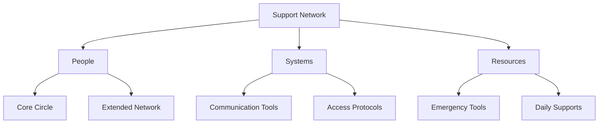

> [!tip] Support Isn't About Dependence
> A strong support network isn't about relying on others to fix things. It's about creating intentional connections and systems that help you navigate challenges while building your own capabilities. Think of it as building a safety net that helps you climb higher.

## Understanding Support Networks

A support network is more than just having people to turn to when things get tough. It's a carefully cultivated system of relationships, resources, and tools that work together to help you thrive. This network needs to be built thoughtfully and maintained regularly to function when you need it most.

## Core Network Components

Your support network consists of three primary elements that work together to create a robust support system. Each component serves different needs and requires different maintenance approaches.

The Inner Circle consists of your closest supporters - people who understand your needs and patterns. These relationships need clear communication about what support looks like for you, established boundaries for both sides, and regular maintenance to stay healthy. This isn't about finding perfect people - it's about building understanding with those you trust.

The Extended Network includes professionals, peers, and community members who can provide specific types of support. This might include therapists, body doubles, activity partners, or others who understand particular aspects of your experience. These connections don't need to know everything about you, just the relevant aspects for their support role.

The Resource System encompasses both tools and protocols that support your daily functioning. This includes everything from crisis response plans to regular check-in systems. Having these resources well-organized and readily accessible means you don't have to figure out what you need in the moment of crisis.

## Building Your Network

Creating an effective support network requires intention and regular attention. This isn't about collecting as many connections as possible - it's about building the right supports for your specific needs.

> [!multi-column]
>
>> ### Relationship Development
>> Focus on building understanding with key supporters. Help them learn your patterns, signals, and needs. Create clear communication about what support looks like for you and what you can offer in return.
>
>> ### System Integration
>> Connect your support network with your other tools like [[🔋 Energy States - Understanding Your Brain's Power Management System|🔋 Energy States]] and [[🛟 Crisis Management - The Impossible Task Protocol|🛟 Crisis Management]]. Make sure supporters know how to work with your systems when needed.
>
>> ### Resource Management
>> Maintain easy access to support tools and protocols. Keep contact information, crisis plans, and support resources organized and updated.

## Support Protocols

Different situations require different types of support. Having clear protocols helps both you and your supporters know how to respond effectively.

### Daily Support Protocol
Regular maintenance of your support system:

1. Check in with core supporters at established intervals
2. Update relevant parties about any system changes
3. Practice using support tools during calm periods
4. Maintain clear communication channels

### Crisis Support Protocol
When you need immediate assistance:

1. Identify the type of support needed
2. Access appropriate level of support
3. Communicate needs clearly using established protocols
4. Follow up after crisis passes

### Recovery Support Protocol
After challenging periods:

1. Process with appropriate supporters
2. Update protocols based on experience
3. Strengthen identified weak points
4. Express appreciation to supporters

## Network Maintenance

A support network needs regular attention to stay healthy and functional. This maintenance ensures your network remains strong and ready when needed.

Regular Check-in Process:
- Review relationship health with core supporters
- Update contact information and protocols
- Assess effectiveness of current support systems
- Identify areas needing strengthening

Growth and Evolution:
- Expand network thoughtfully based on identified needs
- Develop new support protocols as patterns emerge
- Strengthen existing connections through clear communication
- Release connections that no longer serve their purpose

## Crisis Preparation

Your support network needs to be ready before crises hit. This means having clear plans and protocols in place for different types of challenges.

Emergency Response Plan:
- Clear activation signals for different support needs
- Multiple ways to access help
- Established communication protocols
- Backup plans for primary supports

Recovery Support Structure:
- Post-crisis processing protocols
- System reset procedures
- Relationship repair guidelines
- Learning integration methods

## Related Systems
[[🛟 Crisis Management - The Impossible Task Protocol|🛟 Crisis Management]] | [[🔋 Energy States - Understanding Your Brain's Power Management System|🔋 Energy States]] | [[🏠 Environmental Support - Designing Your Productivity Ecosystem|🏠 Environmental Support]] | [[🧠 The Unseen Guide - Unmasking Your Productivity Patterns 🔓|Pattern Recognition]]
