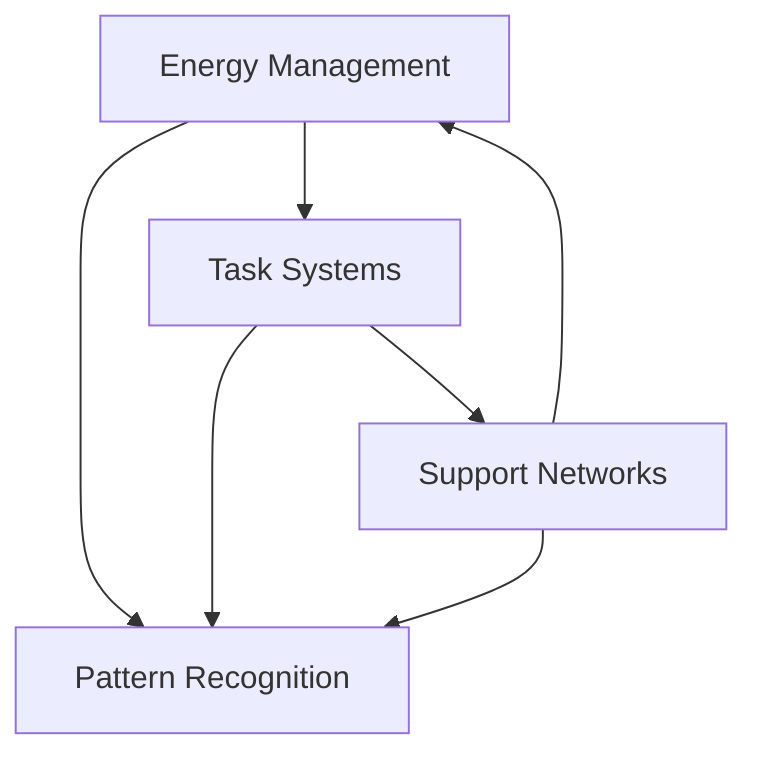

> [!tip] Need Help Right Now?
> If you're in a difficult moment - maybe staring at a task you can't start, feeling overwhelmed by options, or struggling to maintain focus:
> 1. Go directly to [[🚨 The Momentum Activation Protocol - Navigating Task Initiation Challenges|🆘 Emergency Start]] - immediate help for when you're stuck
> 2. Check your [[🔋 Energy States - Understanding Your Brain's Power Management System|🔋 Energy State]] - match your capacity to your needs
> 3. Find something doable on the [[✅ Quick Wins List - Your Momentum-Building Toolkit|✅ Quick Wins]] - small steps to build momentum
> 4. Get crisis support from [[🛟 Crisis Management - The Impossible Task Protocol|🛟 Crisis Help]] - when you need more structured support

## Welcome to Your Support System

Picture this: You're sitting at your desk, staring at your to-do list. Your brain feels like it's simultaneously racing and frozen. You know what you need to do, but starting feels impossible. Or maybe you started strong but now you're scattered across three different tasks, none of them quite finished. Perhaps you're just having one of those days where everything feels like it's turned up to 11 - too bright, too loud, too much.

Sound familiar? You're not alone, and more importantly - there's nothing wrong with your brain. It's just wired differently.

This Executive Function Support System is your personal toolkit for navigating life with a neurodivergent brain. Think of it as having a wise friend in your pocket who understands how your mind works and can help you find your way when things get foggy.

### What Makes This System Different?

Traditional productivity systems often feel like they're written for someone else - someone whose brain naturally breaks tasks into neat chunks, who can "just start" when they need to, who doesn't get overwhelmed by sensory input or stuck in executive function quicksand. This system is different because:

- **It Adapts to You:** Having a high-energy, focused day? Great, there's a framework for that. Barely functioning in zombie mode? We've got you covered there too. The system meets you where you are.
- **Multiple Entry Points:** Whether you think in pictures, need step-by-step instructions, or prefer diving into theory, you'll find your way in. No single "right" way to use these tools.
- **Built-in Safety Nets:** Every component includes emergency protocols and recovery strategies. Because we know that executive function can be unpredictable, and you need support most when things aren't going smoothly.
- **Pattern Recognition:** Instead of forcing yourself into a rigid system, these tools help you recognize and work with your natural patterns and strengths.
- **Living System:** This isn't a static set of rules - it's a growing, evolving collection of strategies that adapt as you learn what works for you.

## Finding What You Need

### 🚨 For Immediate Help

Think of the **Emergency Tools** section as your first aid kit for executive function challenges. When everything feels like too much:

- [[🚨 The Momentum Activation Protocol - Navigating Task Initiation Challenges|🚨 The Momentum Activation Protocol]] - Straightforward steps to break through task paralysis, starting with actions as small as "look at your task list" or "move one object related to your task"
- [[🔋 Energy States - Understanding Your Brain's Power Management System|🔋 Energy State]] - Quick assessment and matching tools to work with your available energy, not against it
- [[✅ Quick Wins List - Your Momentum-Building Toolkit|✅ Quick Wins List]] - Pre-selected, low-barrier tasks that can help you build momentum when starting feels impossible
- [[🛟 Crisis Management - The Impossible Task Protocol|🛟 Crisis Management]] - Structured support for those moments when you need more than just task management

### 📅 For Daily Support

These **Daily Essentials** are your regular tools for navigating each day, designed to work with your brain's natural patterns:

- [[🍽️ Task Menus|Today's Tasks]] - Like a restaurant menu for tasks, offering choices based on your current energy and capacity
- [[🔋 Energy States - Understanding Your Brain's Power Management System|Energy Guide]] - Understanding and working with your energy fluctuations instead of fighting them
- [[🧠 The Unseen Guide - Unmasking Your Productivity Patterns 🔓|Pattern Recognition]] - Simple ways to notice what works for you, building your personal instruction manual
- [[🛠️ Maintenance Master System - Keeping Your System Running Smoothly|Maintenance]] - Light-touch ways to keep your support systems running without getting overwhelmed

### 🔧 Core Systems

These foundational elements work together like a well-oiled machine, each supporting the others:

Think of Energy Management as your fuel gauge, Task Systems as your engine, and Support Networks as your maintenance crew. Pattern Recognition helps you optimize how they all work together.

## Getting Started

### If You're New Here
Maybe you've just realized you're neurodivergent, or you're tired of fighting with systems that weren't built for your brain. Start here:

1. Begin with the [[Getting Started Guide]] - it's like having a friendly tour guide
2. Learn to check your [[🔋 Energy States - Understanding Your Brain's Power Management System|energy levels]] - understanding your available resources
3. Build your personal [[✅ Quick Wins List - Your Momentum-Building Toolkit]] - creating your own momentum-building tools
4. Set up basic [[🏠 Environmental Support - Designing Your Productivity Ecosystem]] - making your space work for you

### If You're in a Rough Patch
Everyone has difficult days. When you're struggling:

1. Use the [[🛟 Crisis Management - The Impossible Task Protocol]] - step-by-step support when things are hard
2. Focus only on [[✅ Quick Wins List - Your Momentum-Building Toolkit|small wins]] - build momentum gradually
3. Activate your [[🤝 Support Network - Building Your Circle of Strength]] - you don't have to do this alone
4. Remember your [[🚨 The Momentum Activation Protocol - Navigating Task Initiation Challenges]] - small steps forward still count

### If You're Ready to Build
When you're feeling stable and want to strengthen your support systems:

1. Explore the [[🎯 Task Management Systems - Building Your Personal Productivity Engine|Task Management Systems]] - find tools that match your thinking style
2. Start [[🧠 The Unseen Guide - Unmasking Your Productivity Patterns 🔓|Pattern Recognition]] - learn what works for you
3. Create your [[🏠 Environment Anchors - Designing Spaces That Support Your Brain]] - design spaces that support you
4. Customize your [[🎯 Task Management Systems - Building Your Personal Productivity Engine|System Maintenance]] - keep things running smoothly

## Finding Your Path

> [!multi-column]
>
>> ### 🌅 Morning Support
>> Start your day with:
>> - [[Daily Review Template]] - gentle planning
>> - [[🔋 Energy States - Understanding Your Brain's Power Management System|Energy Check]] - know your capacity
>> - [[🍽️ Task Menus]] - match tasks to energy
>> - [[🏠 Environmental Support - Designing Your Productivity Ecosystem]] - set up for success
>
>> ### 🌞 Daily Navigation
>> Keep moving with:
>> - [[✅ Quick Wins List - Your Momentum-Building Toolkit]] - maintain momentum
>> - [[Task Management Systems]] - structured support
>> - [[Pattern Recognition]] - learn as you go
>> - [[🤝 Support Network - Building Your Circle of Strength]] - stay connected
>
>> ### 🌙 Evening Reset
>> Wind down with:
>> - [[System Maintenance]] - light upkeep
>> - [[Pattern Tracking Template]] - note what worked
>> - [[🏠 Environment Anchors - Designing Spaces That Support Your Brain]] - prepare for tomorrow
>> - [[Weekly Review Template]] - gentle reflection

## System Evolution

Remember: This isn't about achieving perfect productivity or forcing yourself to work like a neurotypical brain. It's about building a support system that helps you thrive as you are. Use the [[🧠 The Unseen Guide - Unmasking Your Productivity Patterns 🔓|Pattern Recognition Guide]] to track what works for you, and don't hesitate to adapt any part of the system to better match your needs.

## Additional Resources

### 🤝 Support Tools
When you need extra help:
- [[Body Doubling Resources]] - work alongside others
- [[ADHD Support Tools]] - specific tools for attention management
- [[Autism Support Tools]] - sensory and routine support
- [[Crisis Support Links]] - professional help when needed

### 🎨 Customization
Make it yours:
- [[🚀 Setting Up Your Executive Function Support System|System Setup Guide]] - step-by-step setup
- Available Themes - match your visual preferences
- Mobile Optimization - support on the go
- Focus Mode Settings - reduce overwhelm

## Remember

This system exists to support you, not to add pressure or become another source of stress. Start where you are, use what helps, and ignore what doesn't. Every small step forward counts, and there's always a way back to stability when things get overwhelming.

Your brain isn't broken - it's just running on a different operating system. These tools are here to help you work with your natural patterns and strengths, not against them.

Would you like to:
1. [[✨ Getting Started with Your Executive Function Support System|Start Your Journey]]?
2. [[🛟 Crisis Management - The Impossible Task Protocol|Get Immediate Help]]?
3. [[🧠 Executive Function Support System|Learn the System]]?
4. [[🤝 Support Network - Building Your Circle of Strength|Find Support]]?
